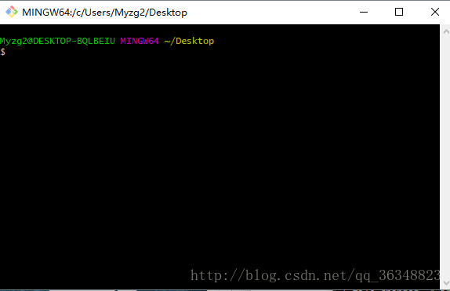
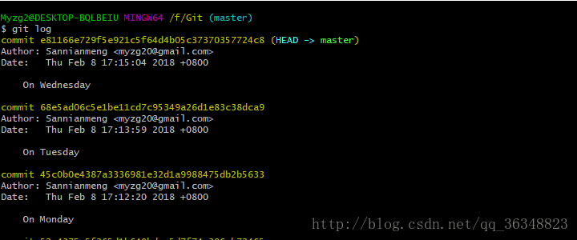
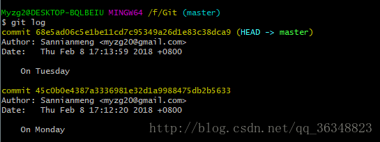

# Git基本使用

## 一、安装：

**1. 安装完成后，在开始菜单里找到“Git”->“Git Bash”，蹦出一个类似命令行窗口的东西，就说明Git安装成功！**

**安装完成后，还需要最后一步设置，在命令行输入：**

> $ git config –global user.name “Your Name”
>
> $ git config –global user.email “email@example.com”

- Git是分布式版本控制系统，所以，每个机器都必须自报家门：你的名字和Email地址。
- 注意`git config`命令的`--global`参数，用了这个参数，表示你这台机器上所有的Git仓库都会使用这个配置，当然也可以对某个仓库指定不同的用户名和Email地址。

## 二、创建版本库

**第一步、进入F盘，然后进入F盘的名为Git的文件夹：**

`$ cd F:` 进入F盘。
`$ cd Git` 进入F盘的名为Git的文件夹。
`pwd`命令用于显示当前目录。在我的为，这个仓库位于`/f/Git`。
`$ cd ..` 返回上一级目录(cd和..之间必须有一个空格)。

**第二步，通过`git init`命令把这个目录变成Git可以管理的仓库：**

**这样就把Git仓库建好了，这是一个空的仓库（empty Git repository），并且目录下多了一个`.git`的目录，这个目录是Git来跟踪管理版本库的，不要去修改这个目录里面的文件。**

## 三、版本回退

**1. 修改readme.txt文件的内容，然后把修改提交到Git版本库，内容下：**

**然后尝试提交：**

**这个过程类似游戏存档，每通过一个关卡存一次档，就不用怕游戏人物死后从头再刷关卡，直接在最近关卡原地复活就好**

> `git add readme.txt` //表示将这个文件预添加到仓库，这一句不会有什么反应
> `git commit -m "On Wednesday"` //确认提交
> `rmdir Git` 删除文件夹
> `rm readme.txt` //删除文件

**现在，我们回顾一下readme.txt文件一共有几个版本被提交到Git仓库里了：**

- 版本1：On Monday

> On Monday：
> Today is Monday. I am studying.

- 版本2：On Tuesday

> On Tuesday：
> Today is Tuesday. I am studying.

- 版本3：On Wednesday

> On Wednesday：
> It’s Wednesday. I’m studying.

当然了，在实际工作中，我们脑子里怎么可能记得一个几千行的文件每次都改了什么内容，不然要版本控制系统干什么。版本控制系统肯定有某个命令可以告诉我们历史记录，在Git中，我们用`git log`命令查看：

`git log`命令显示从最近到最远的提交日志，我们可以看到3次提交，最近的一次是`On Wednesday`，上一次是`On Tuesday`，最早的一次是`On Monday`。画面简洁一点，可以使用`--pretty=oneline`参数；

- 大串类似45c0b0…5633的是`commit id`（版本号）

**2.把readme.txt回退到上一个版本，也就是`On Tuesday`的那个版本**

首先，要知道当前Git版本是哪个版本，在Git中，用`HEAD`表示当前版本，也就是最新的提交`e81166e..7724c8`，上一个版本就是`HEAD^`，上上一个版本就是`HEAD^^`，当然往上100个版本写100个^比较容易数不过来，所以写成`HEAD~100`。

现在，我们要把当前版本“On Wednesday”回退到上一个版本“On Tuesday”，就可以使用`git reset`命令：

- `--hard`参数对于小白的我来说暂时也不知道什么意思，听大神的话放心使用就好。

**看看readme.txt的内容是不是版本`On Tuesday`,可以使用`cat readme.txt`查看**

我们再用`git log`命令查看，你会发现最新的那个版本”On Wednesday “已经看不到了！

现在我又想返回去看最新的那个版本库怎么办？办法其实还是有的，只要上面的命令行窗口还没有被关掉，你就可以顺着往上找，找到那个“On Wednesday”的`commit id`号，于是就可以指定回到未来的某个版本：

**版本号没必要写全，前几位就可以了，Git会自动去找。当然也不能只写前一两位，因为Git可能会找到多个版本号，就无法确定是哪一个了。**

**再用`cat readme.txt`命令查看readme.txt的内容，你会发现之前的版本又回来了：**

**现在，你回退到了某个版本，关掉了电脑，第二天早上就后悔了，想恢复到新版本怎么办？找不到新版本的`commit id`怎么办？**

在Git中，总是有后悔药可以吃的。当你用`$ git reset --hard HEAD^`回退到`On Tuesday`版本时，再想恢复到`On Wednesday`，就必须找到`On Wednesday`的`commit id`。Git提供了一个命令`git reflog`用来记录你的每一次命令：

你就会发现`On Wednesday`的`commit id`是`e81166e`，现在，你又可以乘坐时光机回到未来了。

`HEAD`指向的版本就是当前版本，因此，Git允许我们在版本的历史之间穿梭，使用命令`git reset --hard commit_id`。
穿梭前，用`git log`可以查看提交历史，以便确定要回退到哪个版本。
要重返未来，用`git reflog`查看命令历史，以便确定要回到未来的哪个版本。

## 注：

纯本人小白，只为学习+做记录（加深印象），学习资源全來于廖雪峰老师！

# Git命令行使用

#### 在当前目录下初始化一个空的git仓库

- `git init`

#### 设置全局用户名和邮箱

- `git config --global user.name "name"`
- `git config --global user.email "xxxxx@email.com"`
- `git config user.name` 查看git用户名
- `git config user.email` 查看邮箱配置

#### 查看git配置

- `git config --list`

#### 提交修改到暂存区

- `git add -A` 提交全部修改。（git add -All）
- `git add -u` 只提交修改，不提交新文件。（git add -update)
- `git add .` 不提交删除文件
- `git add <filename>` 提交指定文件

#### 查看暂存区

- `git status`

#### 修改最新提交的 commit message

- `git commit --amend`

#### 修改某个提交的 commit message

- `git commit -i <commit id>` commit id 为要修改的目标 commit 的父亲 commit id

#### 合并连续的commit

- `git rebase -i <commit id>` commit id 为目标commit的父亲commit id

#### 提交修改到本地仓库

- `git commit -m 'msg'` 提交暂存区到本地仓库
- `git commit -a -m 'msg'` 提交修改到本地仓库（不提交新增文件）

#### 查看提交记录

- `git log`

#### 添加远程仓库

- `git remote add <name> <url>`

#### 查看远程仓库信息

- `git remote show <name>`

#### 远程仓库的删除和重命名

- `git remote rm <remote_name>`
- `git remote rename <old_name> <new_name>`

#### 拉取远程仓库数据到本地

- `git pull <remote_name> <branch_name>`

#### 提交本地仓库到远程仓库

- `git push <remote_name> <branch_name>`

#### 查看&创建&切换分支

- `git branch` 查看已有分支
- `git branch -v` 查看已有分支及各个分支最后一个提交对象的信息
- `git branch <branch_name>` 创建新的空分支
- `git branch <branch_name> <exist_branch_name>` 创建新分支
- `git checkout -b <branch_name> <exist_branch_name>` 创建并切换到新分支
- `git checkout <branch_name>` 切换分支

#### 删除&合并分支

- `git branch -D <branch_name>` 删除分支
- `git merge <branch_name>` 当前分支合并到指定分支

#### 暂存区恢复到HEAD

- `git reset HEAD`
- `git reset HEAD <file_name>`

#### 工作区恢复到暂存区

- `git checkout -- <file_name>`

# IDEA中颜色与版本控制

在安装了Git或者SVN以后发现idea类名出现了不同的颜色，如下:

它们分别表示的含义：

**绿色**，已经加入控制暂未提交
**红色**，未加入版本控制
**蓝色**，加入，已提交，有改动
**白色**，加入，已提交，无改动
**灰色**：版本控制已忽略文件。