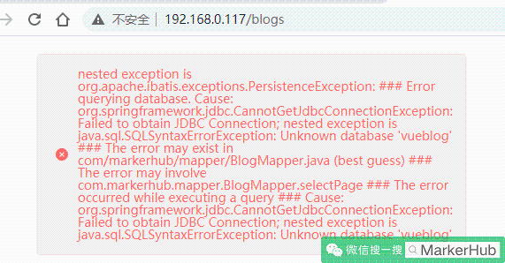
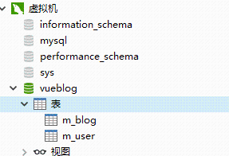
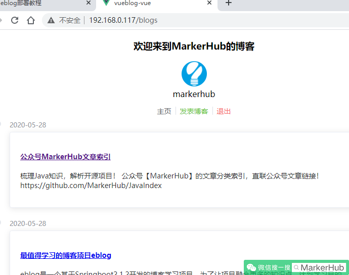

# 手把手教你Docker+nginx部署Springboot+vue前后端分离项目

#### 小Hub领读：

前后端分离项目如何部署？看看这篇文章，马上就懂了哈，还有配套视频讲解，嘻嘻，记得一键三连！

------

### 项目回顾

之前我录制过一个视频，现在也已经8万多播放量了呀，哈哈，感谢大家的认可，大家可以关注我的B站，名称叫**MarkerHub**，公众号同名。

其实我觉得我已经录制得很详细的了，可能大家水平不一，有些人觉得我很多地方讲清楚，还有就是有些人按照视频同步做实验，还一路踩坑，这个我也预料不到哈哈。说实话，我自己做实验的过程还是挺顺利的。

有些同学们提出个问题，不知道如何打包部署Vue前后端分离项目。那么今天，我们就来学习一下，如何部署简单快捷部署我们的vueblog项目！

**这里给出vueblog项目的视频地址：**

名称：[实战]基于SpringBoot+Vue开发的前后端分离博客项目完整教学（vueblog）

视频：[www.bilibili.com/video/BV1PQ…](https://www.bilibili.com/video/BV1PQ4y1P7hZ/)

文档：[juejin.im/post/684490…](https://juejin.im/post/6844903823966732302)

线上演示：[www.markerhub.com:8084/blogs](http://www.markerhub.com:8084/blogs)

### 配套部署视频

[www.bilibili.com/video/BV17A…](https://www.bilibili.com/video/BV17A411E7aE/)

### 工具

- xshell 6 绿色破解版：关注公众号：**JavaCat**，回复**xshell**获取
- Navicat 11 简体中文版：关注公众号：**JavaCat**，回复**navicat**获取

### 上线前准备

这里我们同步演示怎么部署到win环境和linux（centos7）系统中，前端服务器采用nginx部署，并使用docker统一管理前后端服务器。

所以我们会用到：

- nginx
- docker compose

希望你看视频前有点基础哈，当然了，这次部署比较简单，不需要很精通，一般看了我的视频应该都能部署成功的哈。

话不多说，直接上手！别忘了给我一个一键三联哈，顺便关注我B站，感谢！

### 1、win环境

win环境我就用本机来演示了，我们需要分别打包前后端，前后端打包都是一条命令即可，只不过我们打包之前注意需要配置好线上的环境参数等。

#### 1.1、前端

先来配置一下后端的调用路径，因为现在部署在本地localhost，所以在axios.js中，我们配置好链接，因为等下后端部署也是本机，所以我这里直接这样配置就好了，如下：

- src\axios.js

```plain
axios.defaults.baseURL = "http://localhost:8081"
复制代码
```

上面配置的就是前端访问后端接口的服务。 然后前端部署还需要考虑一个问题：打包之后项目资源引用路径，比如我们打包后链接是否需要带项目名称等。按照Vue官方的部署说明，我们添加一个**vue.config.js**文件，

- vueblog-vue/vue.config.js

```plain
module.exports = {
  publicPath: '/'
}
复制代码
```

当然了，publicPath默认其实是空的，也就是publicPath: ''，两个效果貌似其实是一样的，哈哈哈，我只是提醒一下有这回事而已，嘿嘿。 设置完毕之后，我们执行打包命令：

```plain
# 打包命令
npm run build
复制代码
```

命令执行之后，我们在项目根目录下就可以找到一个dist的目录，这个就是打包之后的文件夹，里面有个index.html，但是我们点击直接打开是看不到任何内容的，这时候，我们需要部署到nginx中。


首先我们下载一个nginx，下载地址：[nginx.org/en/download…](http://nginx.org/en/download.html)，这里我们下载nginx/Windows-1.18.0版本，下载之后解压zip。根据我们对nginx的熟悉，静态文件我们放在html文件夹下面，所以先把html文件夹中的index.html和50x.html删掉，然后把打包出来的dist文件夹内的所有文件都复制到nginx的html中，如图：


双击nginx.exe启动nginx，然后浏览器输入[http://localhost](http://localhost/)，出现了我们熟悉的界面，虽然没有博客数据，链接也自动跳转到了http://localhost/blogs，


我们点击任意一个链接或者按钮或者刷新界面，这时候出现了404：


刷新之后nginx就找不到路由了，这是为啥，得和你们科普一下，vue项目的入口是index.html文件，nginx路由的时候都必须要先经过这个文件，所以我们得给nginx定义一下规则，让它匹配不到资源路径的时候，先去读取index.html，然后再路由。所以我们配置一下nginx.conf文件。具体操作就是找到**location /**,添加上一行代码**try_files uri\*u\**r\**i\*uri/ /index.html last**;如下：

- nginx-1.18.0/conf/nginx.conf

```plain
location / {
    root   html;
    try_files $uri $uri/ /index.html last;
    index  index.html index.htm;
}
复制代码
```

这一行代码是什么意思呢？ try_files的语法规则： 格式1：try_files file ... uri，表示按指定的file顺序查找存在的文件，并使用第一个找到的文件进行请求处理，last表示匹配不到就内部直接匹配最后一个。

重启nginx之后，链接再刷新都正常啦。但是没有数据，所以我们去部署一下后端。windows环境nginx的重启我一般都是打开任务管理器直接干掉nginx进程，然后再重新双击的~~


#### 1.2、后端

后端的打包就简单多了，应该大家都挺熟悉的，注意配置redis、mysql的链接密码啥的，然后执行命令，本机测试，redis和mysql我都已经提前安装好的了，sql文件也在vueblog-java的resources目录下。

对了，pom.xml文件里面，spring-boot-maven-plugin之前注释掉了，现在一定要打开。不然执行jar会找不到主类。

- pom.xml


执行打包命令：

```plain
# 跳过测试打包
mvn clean package -Dmaven.test.skip=true
复制代码
```

得到target下的vueblog-0.0.1-SNAPSHOT.jar，然后再执行命令

```plain
java -jar vueblog-0.0.1-SNAPSHOT.jar --spring.profiles.active=default
复制代码
```

后端上线之后，我们再访问下前端，发现已经可以正常浏览网页啦！spring.profiles.active表示指定环境配置文件。 

### 2、linux环境

linux环境部署相对复杂一点，因为我们还要部署redis、mysql等。之前我发布过一个视频，是部署传统的博客项目eblog，采用的是docker容器，但是我们没有docker compose进行编排，这次我们使用docker compose来编排我们的服务，一起性搞定部署。

二话不说，我们先来安装一下docker和docker compose，对于docker知识还不是特别懂的同学，建议自行去补习补习哈。

#### 2.1、安装docker

```plain
#安装
yum install docker
#检验安装是否成功
[root@localhost opt]# docker --version
Docker version 1.13.1, build 7f2769b/1.13.1
#启动
systemctl start docker
复制代码
```

#### 2.2、安装docker compose

可以参考：[docs.docker.com/compose/ins…](https://docs.docker.com/compose/install/)

```plain
sudo curl -L "https://github.com/docker/compose/releases/download/1.27.4/docker-compose-$(uname -s)-$(uname -m)" -o /usr/local/bin/docker-compose
#
sudo chmod +x /usr/local/bin/docker-compose
# 检查是否安装成功
docker-compose --version
复制代码
```

#### 2.3、编写Dockerfile文件

因为我们的项目需要成为docker的镜像，所以我们必须先编写Dockerfile文件构建我们的项目镜像然后进行编排，Dockerfile文件可以帮我们进行构建。

- Dockerfile

```plain
FROM java:8
EXPOSE 8080
ADD vueblog-0.0.1-SNAPSHOT.jar app.jar
RUN bash -c 'touch /app.jar'
ENTRYPOINT ["java", "-jar", "/app.jar", "--spring.profiles.active=pro"]
复制代码
```

上面几行命令其实很简单，首先依赖jdk8环境，对外暴露8080，然后就是复制vueblog-0.0.1-SNAPSHOT.jar到docker容器中并命名为app.jar，最后是执行命令**java -jar /app.jar --spring.profiles.active=pro**，使用的是我们另外编写的一个线上环境配置。

- application-pro.yml

```plain
# DataSource Config
spring:
  datasource:
    driver-class-name: com.mysql.cj.jdbc.Driver
    url: jdbc:mysql://localhost:3306/vueblog?useUnicode=true&useSSL=false&characterEncoding=utf8&serverTimezone=Asia/Shanghai
    username: root
    password: admin
shiro-redis:
  enabled: true
  redis-manager:
    host: 127.0.0.1:6379
复制代码
```

等会儿我们需要修改application-pro.yml的redis和mysql链接等信息的一些配置，需要注意。

#### 2.4、编写docker-compose.yml文件

我们需要用到的软件与服务分别有nginx、mysql、redis、还有我们的springboot项目，所以编写如下：

- docker-compose.yml

```plain
version: "3"
services:
  nginx: # 服务名称，用户自定义
    image: nginx:latest  # 镜像版本
    ports:
    - 80:80  # 暴露端口
    volumes: # 挂载
    - /root/nginx/html:/usr/share/nginx/html
    - /root/nginx/nginx.conf:/etc/nginx/nginx.conf
    privileged: true # 这个必须要，解决nginx的文件调用的权限问题
  mysql:
    image: mysql:5.7.27
    ports:
    - 3306:3306
    environment: # 指定用户root的密码
      - MYSQL_ROOT_PASSWORD=admin
  redis:
    image: redis:latest
  vueblog:
    image: vueblog:latest
    build: . # 表示以当前目录下的Dockerfile开始构建镜像
    ports:
    - 8081:8081
    depends_on: # 依赖与mysql、redis，其实可以不填，默认已经表示可以
      - mysql
      - redis
复制代码
```

上面的意思，我都用注释解释一遍了，希望可以讲清楚！需要注意的是，nginx中我们对nginx的放置静态资源的html文件夹和配置文件nginx.conf进行了一个挂载，所以我们打包后的文件放置到宿主机**/root/nginx/html**文件目录就行了哈

#### 2.5、修改application-pro.yml

然后我们再回头看看application-pro.yml文件，mysql和redis的链接之前还是localhost，现在我们需要修改成容器之间的调用，如何知道mysql和redis的链接地址呢？docker compose就帮我们解决了这个问题，我们可以使用镜像容器的服务名称来表示链接。比如docker-compose.yml中mysql的服务名称就叫mysql、redis就叫redis。


所以我们最终得到的配置文件如下：


#### 2.6、准备好nginx的挂载目录和配置

docker-compose.yml中已经提到，

- 宿主机的挂载目录：/root/nginx/html
- 挂载配置：/root/nginx/nginx.conf

所以我们在root目录下新建nginx目录，并进入nginx目录下新建html目录和一个nginx.conf配置文件。


然后对nginx.conf进行编写，具体配置如下：

- nginx.conf

```plain
#user  root;
worker_processes  1;
events {
    worker_connections  1024;
}
http {
    include       mime.types;
    default_type  application/octet-stream;
    sendfile        on;
    keepalive_timeout  65;
    server {
        listen       80;
        server_name  localhost;
        location / {
            root   /usr/share/nginx/html;
			try_files $uri $uri/ /index.html last; # 别忘了这个哈
            index  index.html index.htm;
        }
        error_page   500 502 503 504  /50x.html;
        location = /50x.html {
            root   html;
        }
    }
}
复制代码
```

#### 2.7、上传前端

前端打包之后先修改前端调用后端的接口，因为我是虚拟机，所以配置如下：

- axios.js

```plain
axios.defaults.baseURL = "http://192.168.0.117:8081"
复制代码
```

然后**npm run build**打包得到**dist**文件夹，并把dist压缩成dist.zip上传到linux之后解压到**/root/nginx/html**目录下。如下图： 

#### 2.8、部署后端

一切准备就绪之后，我们就开始编排部署了哈。

首先本地打包vueblog项目，vueblog-0.0.1-SNAPSHOT.jar，并上传到linux中，同时docker-compose.yml、Dockerfile也上传到同一目录下。如图所示：


然后我们执行一下编排命令:

```plain
# 开始编排
cd ~
docker-compose up -d
复制代码
```

其中-d表示后台服务形式启动 

然后我们稍等片刻，特别是开始**Building vueblog**的时候可能时间有点长，耐心等待即可！

最后提示如下：


说明我们已经成功编排啦。

nginx是80端口，所以我们直接输入ip地址，如下可以看到一个界面然后有弹窗：



这个简单，是因为我们的数据库还没创建哈。接下来我们去手动创建一下数据库并导入sql文件。

- vueblog-java/src/main/resources/vueblog.sql



然后再刷新一下浏览器链接，数据就出来啦，搞定，轻松！

#### 

### 3、结束语

好啦，部署完毕，别忘了一键三联，关注我的B站MarkerHub，公众同名，哈哈。