MyBatis

环境:

●JDK1.8

●Mysql 5.7

●maven 3.6.1

●IDEA

回顾:

●JDBC

●Mysql

●Java基础

●Maven

●Junit

SSM框架:配置文件的。 最好的方式: 看官网文档。

## 1、简介

### 1.1、 什么是Mybatis

●MyBatis 是-款优秀的**持久层**框架

●它支持定制化SQL、存储过程以及高级映射。

●MyBatis避免了几乎所有的JDBC代码和手动设置参数以及获取结果集。

●MyBatis 可以使用简单的XML或注解来配置和映射原生类型、接口和Java的POJO (Plain Old Java
Objects,普通老式Java对象)为数据库中的记录。

●MyBatis 本是apache的一个开源项目Batis, 2010年这个项目由apache software foundation迁移到了
google code,并且改名为MyBatis。

●2013年11月迁移到Github.

#### 如何获得Mybatis?

●maven仓库:

```xml
<!-- https://mvnrepository.com/artifact/org.mybatis/mybatis -->
    <dependency>
      <groupId>org.mybatis</groupId>
      <artifactId>mybatis</artifactId>
      <version>3.5.2</version>
    </dependency>
```

●Github: https://github.com/mybatis/mybatis-3/releases

●中文文档: https://mybatis.org/mybatis-3/zh/index.html

### 1.2、持久化

#### 数据持久化

●持久化就是将程序的数据在持久状态和瞬时状态转化的过程

●内存:**断电即失**

●数据库(Jdbc), io文件持久化。

●生活:冷藏.罐头。

#### 为什么需要需要持久化?

●有一些对象，不能让他丢掉。

●内存太贵了

### 1.3、 持久层

Dao层，Service层， Controller层...

●完成持久化工作的代码块

●层界限十分明显。

### 1.4为什么需要Mybatis?

●帮助程序猿将数据存入到数据库中。

●方便

●传统的JDBC代码太复杂了。简化。框架。自动化。

●不用Mybatis也可以。更容易上手。技术没有高低之分

●优点:

。简单易学

。灵活

。sq|和代码的分离，提高了可维护性。

。提供映射标签，支持对象与数据库的orm字段关系映射

。提供对象关系映射标签，支持对象关系组建维护

。提供xml标签,支持编写动态sql。

**最重要的一点:使用的人多!**

Spring SpringMVC SpringBoot

## 2、第一个Mybatis程序

思路:搭建环境->导入Mybatis-->编写代码-->测试!

### 2.1、搭建环境

1.搭建数据库

```mysql
CREATE DATABASE mybatis;

CREATE TABLE user(
id INT(20) NOT NULL PRIMARY KEY,
name VARCHAR(30) DEFAULT NULL,
pwd VARCHAR(30) DEFAULT NULL
) ENGINE=INNODB DEFAULT CHARSET=utf8;
//设置引擎和字符集
use mybatis;

insert into user(id,name,pwd)values(1,'雏田','123456'),(2, '手鞠', '123456'),(3, '琳', '123890');
```

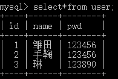

2.新建项目

1. 新建一个普通的maven项目
2. **删除src目录（就创建一了个父项目，所有子向目均使用父项目的pom.xml文件即可)**
3. 导入maven所需依赖

```xml
<dependencies>
        <!--连接数据库-->
        <dependency>
            <groupId>mysql</groupId>
            <artifactId>mysql-connector-java</artifactId>
            <version>5.1.17</version>
        </dependency>
     <!-- https://mvnrepository.com/artifact/org.mybatis/mybatis -->
        <dependency>
            <groupId>org.mybatis</groupId>
            <artifactId>mybatis</artifactId>
            <version>3.5.2</version>
        </dependency>
        <!--单元测试-->
        <dependency>
            <groupId>junit</groupId>
            <artifactId>junit</artifactId>
            <version>4.11</version>
        </dependency>
    </dependencies>
```

### 2.2、创建一个子模块

1.编写mybatis的核心配置文件mybatis-config.xml

```xml
<?xml version="1.0" encoding="UTF-8" ?>
<!DOCTYPE configuration
        PUBLIC "-//mybatis.org//DTD Config 3.0//EN"
        "http://mybatis.org/dtd/mybatis-3-config.dtd">
<configuration>
    <environments default="development">
        <environment id="development">
            <transactionManager type="JDBC"/>
            <dataSource type="POOLED">
                <property name="driver" value="com.mysql.jdbc.Driver"/>
                <property name="url" value="jdbc:mysql://localhost:3306/mybatis?useSSL=false&amp;useUnicode=true&amp;characterEncoding=utf-8&amp;autoReconnect=true"/>
                <property name="username" value="root"/>
                <property name="password" value="981204"/>
            </dataSource>
        </environment>
    </environments>
    <mappers>
        <mapper resource="com/lenovo/dao/UserMapper.xml"></mapper>
    </mappers>
</configuration>
```

2.编写MyBatis工具类

```java
package com.lenovo.util;


import org.apache.ibatis.io.Resources;
import org.apache.ibatis.session.SqlSession;
import org.apache.ibatis.session.SqlSessionFactory;
import org.apache.ibatis.session.SqlSessionFactoryBuilder;

import java.io.InputStream;

public class MybatisUtil {
    private MybatisUtil() {
    }

    public static SqlSession getSqlSession() {
        String resource = "mybatis-config.xml";
        InputStream inputStream = null;
        SqlSession sqlsession = null;
        try {
            //使用Mybatis第一步: 获取sqlSessionFactory对象
            inputStream = Resources.getResourceAsStream(resource);
            SqlSessionFactory sqlSessionFactory = new SqlSessionFactoryBuilder().build(inputStream);
            //既然有了sqlSessionFactory, 顾名思义，我们就可以从中获得sqlsession 的实例了。
            // sqlSession 完全包含了面向数据库执行SQL命令所需的所有方法。
            sqlsession = sqlSessionFactory.openSession();
        } catch (Exception e) {
            e.printStackTrace();
        }
        return sqlsession;
    }

}
```

### 2.3、编写代码

1.实体类

```java
package com.lenovo.pojo;

public class User {
    private int id;
    private String name;
    private String pwd;

    public User() {
    }

    public int getId() {
        return id;
    }

    public void setId(int id) {
        this.id = id;
    }

    public String getName() {
        return name;
    }

    public void setName(String name) {
        this.name = name;
    }

    public String getPwd() {
        return pwd;
    }

    public void setPwd(String pwd) {
        this.pwd = pwd;
    }

    public User(int id, String name, String pwd) {
        this.id = id;
        this.name = name;
        this.pwd = pwd;
    }

    @Override
    public boolean equals(Object o) {
        if (this == o) return true;
        if (o == null || getClass() != o.getClass()) return false;
        User user = (User) o;
        return id == user.id &&
                name.equals(user.name) &&
                pwd.equals(user.pwd);
    }

    @Override
    public String toString() {
        return "User{" +
                "id=" + id +
                ", name='" + name + '\'' +
                ", pwd='" + pwd + '\'' +
                '}';
    }
}
```

2.mapper接口

```java
package com.lenovo.dao;

import com.lenovo.pojo.User;

import java.util.List;

public interface UserMapper {
    List<User> getUserList();

}
```

3.接口实现类

```xml
<?xml version="1.0" encoding="UTF-8" ?>
<!DOCTYPE mapper
        PUBLIC "-//mybatis.org//DTD Mapper 3.0//EN"
        "http://mybatis.org/dtd/mybatis-3-mapper.dtd">
<mapper namespace="com.lenovo.dao.UserMapper">
    <select id="getUserList" resultType="com.lenovo.pojo.User">
   select * from user
  </select>
</mapper>
```

### 2.4、测试

1.注意点:

> 报错：org.apache.ibatis. binding.BindingException: Type interface com.kuang.dao.UserDao is not known to theMapperRegistry

2.MapperRegistry是什么?

3.junit测试

```java
package com.lenovo.dao;

import com.lenovo.pojo.User;
import com.lenovo.util.MybatisUtil;
import org.apache.ibatis.session.SqlSession;
import org.junit.Test;

import java.util.List;

public class UserMapperTest {
    @Test
    public void test() {
        //第一步:获得sqlsession对象
        SqlSession sqlSession = MybatisUtil.getSqlSession();
        System.out.println(sqlSession);
        //方式一: getMapper
        List<User> userlist = sqlSession.getMapper(UserMapper.class).getUserList();

        //方式二:几乎不用，需要强转类型不安全
        //List<User> userlist = sqlSession.selectList("com.lenovo.dao.UserMapper.getUserList");
        for (User user : userlist) {
            System.out.println(user);
        }
        //一定要关闭（重点）
        sqlSession.close();
    }
}
```

#### 你们可以能会遇到的问题:

1.配置文件没有注册

2.绑定接口错误

3.方法名不对

4.返回类型不对

5.Maven导出资源问题

6.**1字节的UTF-8 序列的字节1无效**------->useSSL=false即可解决，还是不行，只能改成GBK了

终极解决办法:

File------》Settings-------》File Encodings

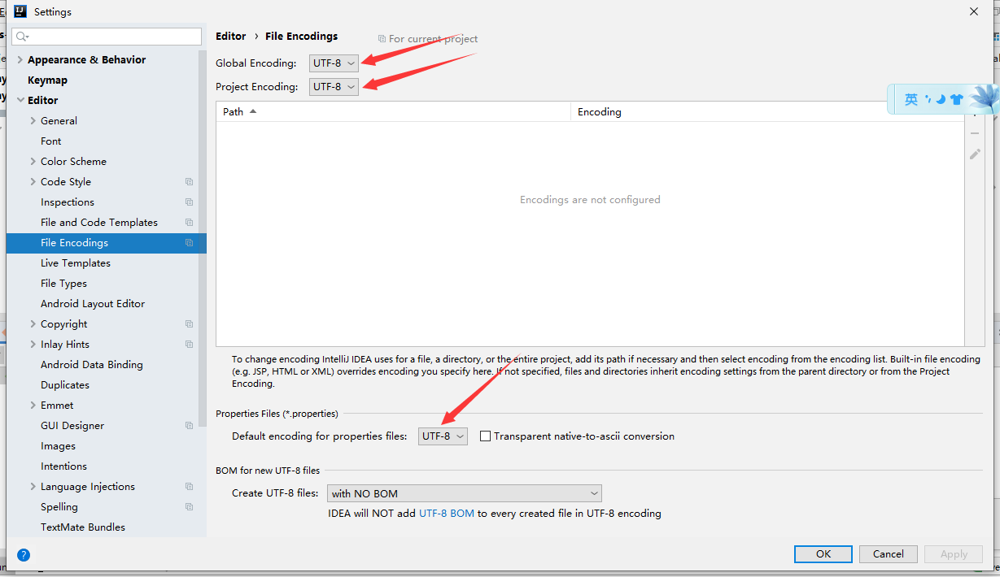

#### 具体搭建顺序如下：


## 3、CRUD

### 3.1、namespace

namespace中的包名要和Dao/mapper接口的包名一致!

### 3.2、select

选择，查询语句;

●id:就是对应的namespace中的方法名;

●resultType: Sq|语句执行的返回值!

●parameterType :参数类型!

#### 步骤：

1.编写接口

```java
 	//查询全部用户信息
    List<User> getUserList();
    //根据id查询用户
    User getUserById(int id);
    //插入一条数据
    int addUser(User user);
    //修改用户
    int updateUser(User user);
    //删除一条用户信息
    void deleteUser(int id);
```

2.编写对应的mapper中的sq|语句

```xml
 <select id="getUserById" parameterType="int" resultType="com.lenovo.pojo.User">
        select * from mybatis.user where id = #{id}
 </select>
```

3.测试

```java
@Test
    public void getUserById() {
        SqlSession sqlSession = MybatisUtil.getSqlSession();
        UserMapper mapper = sqlSession.getMapper(UserMapper.class);
        User user = mapper.getUserById(1);
        System.out.println(user);
        sqlSession.close();
    }
```

### 3.3、Insert

#### 步骤：

1.编写接口

```java
 //插入一条数据
 int addUser(User user);
```

2.编写对应的mapper中的sql语句

```xml
<!--对象中的属性，可以直接取出来-->
    <insert id="addUser" parameterType="com.lenovo.pojo.User">
        insert into user(id,name,pwd) values (#{id},#{name},#{pwd});
    </insert>
```

3.测试

```java
 //增制改需要提交事务
    @Test
    public void addUser() {
        SqlSession sqlSession = MybatisUtil.getSqlSession();
        UserMapper mapper = sqlSession.getMapper(UserMapper.class);
        int res = mapper.addUser(new User(5, "哈哈", "123333"));
        if (res > 0) {
            System.out.println("插入成功!");
        }
        //提交事务
        sqlSession.commit();
        sqlSession.close();
    }
```

### 3.4、update

#### 步骤：

1.编写接口

```java
//修改用户
int updateUser(User user);
```

2.编写对应的mapper中的sq|语句

```xml
 <update id="updateUser" parameterType="com.lenovo.pojo.User" >
        update mybatis.user set name=#{name},pwd=#{pwd} where id=#{id};
 </update>
```

3.测试

```java
  @Test
    public void updateUser(){
        SqlSession sqlSession = MybatisUtil.getSqlSession();
        UserMapper mapper = sqlSession.getMapper(UserMapper . class);
        mapper.updateUser(new User(4,"呵呵","123123"));
        sqlSession.commit();
        sqlSession.close();
    }
```

### 3.5、delete

#### 步骤：

1.编写接口

```java
//删除一条用户信息
void deleteUser(int id);
```

2.编写对应的mapper中的sq|语句

```xml
<delete id="deleteUser" parameterType="int" >
        delete from mybatis.user where id = #{id}; 
</delete>
```

3.测试

```java
 @Test
    public void deleteUser(){
        SqlSession sqlSession = MybatisUtil.getSqlSession();
        UserMapper mapper = sqlSession.getMapper(UserMapper.class);
        mapper.deleteUser(4);
        sqlSession.commit();
        sqlSession.close();
    }
```

注意点:

- **增删改需要提交事务!**

### 3.6、分析错误

●标签不要匹配错

●resource绑定mapper,需要使用路径!

●程序配置文件必须符合规范!

●NullPointerException, 没有注册到资源!

●输出的xml文件中存在中文乱码问题!

●maven资源没有导出问题!

### 3.7、万能Map

假设,我们的实体类，或者数据库中的表，字段或者参数过多,我们应当考虑使用Map!

1.mapper

```java
//万能的Map
int addUser2(Map<String,Object> map);
```

2.mapper.xml

```xml
<!--对象中的属性。可以直接取出来传送map的key-->
<insert id="addUser2" parameterType= "map">
     insert into mybatis.user(id, pwd) values (#{userid}, #{passWord});
</insert>
```

3.测试

```java
 @Test
    public void addUser2() {
        SqlSession sqlSession = MybatisUtil.getSqlSession();
        UserMapper mapper = sqlSession.getMapper(UserMapper.class);
        Map<String, Object> map = new HashMap<String, Object>();
        map.put("userid", 6);
        map.put("passWord", "222333");
        mapper.addUser2(map);
        sqlSession.commit();
        sqlSession.close();
    }
```

Map传递参数，直接在sq|中取出key即可![parameterType="map"]

对象传递参数，直接在sq|中取对象的属性即可! [parameterType="Object"]

只有一个基本类型参数的情况下，可以直接在sq|中取到!

多个参数用Map,或者注解!

### 3.8、思考题

模糊查询怎么写?

#### 3.8.1、Java代码执行的时候，传递通配符% %

1.mapper

```java
//模糊查询
List<User> getUserLike(String value);
```

2.mapper.xml

```xml
 <select id="getUserLike" resultType="com.lenovo.pojo.User">
       select * from mybatis.user where name like #{value}
 </select>
```

3.测试

```java
@Test
    public void getUserLike(){
        SqlSession sqlSession = MybatisUtil.getSqlSession();
        UserMapper mapper = sqlSession. getMapper(UserMapper.class);
        List<User> userlist = mapper.getUserLike("%手%");
        for (User user : userlist) {
            System.out.println(user);
        }
        sqlSession.close();
    }
```

#### 3.8.2、在sql拼接中使用通配符!

mapper.xml

```xml
 select * from mybatis.user where name like "%" #{value} "%";
```

测试

```java
List<User> userlist = mapper.getUserLike("手");
```

## 4、配置解析

#### 4.1、核心配置文件

●mybatis-config.xml

●MyBatis的配置文件包含了会深深影响MyBatis行为的设置和属性信息。

```xml
configuration (配置)
properties (属性)
settings (设置)
typeAliases (类型别名)
typeHandlers (类型处理器)
objectFactory (对象工厂)
plugins (插件)
envi ronments (环境配置)
envi ronment (环境变量)
transactionManager (事务管理器)
datasource (数据源)
databaseIdProvider ( 数据库厂商标识)
mappers (映射器)
```

#### 4.2、环境配置(environments)

MyBatis可以配置成适应多种环境

不过要记住:**尽管可以配置多个环境，但每个SqlSessionFactory实例只能选择一种环境。**

学会使用配置多套运行环境!

Mybatis默认的事务管理器就是JDBC，连接池: POOLED

#### 4.3、属性(properties)

我们可以通过properties属性来实现引用配置文件

这些属性都是可外部配置且可动态替换的，既可以在典型的Java属性文件中配置,亦可通过properties

元素的子元素来传递。[ db.properties]


编写一个配置文件
db.properties

```.properties
driver=com.mysql.jdbc.Driver
url=jdbc:mysql://localhost:3306/mybatis?useSSL=false&useUnicode=true&characterEncoding=utf-8&autoReconnect=true
username=root
password=981204
```

在核心配置文件中映入

```xml
 	<!--引入外部配置文件-->
    <properties resource="db.properties">
        <property name="username" value="root"/>
        <property name="password" value="123456"/>
    </properties>
```

●可以直接引入外部文件

●可以在其中增加一些属性配置

●如果两个文件有同一个字段，优先使用外部配置文件的!

#### 4.4、类型别名(typeAliases)

●类型别名是为Java类型设置一个短的名字。

●存在的意义仅在于用来减少类完全限定名的冗余。

1、

```xml
  <!--可以给实体类起别名-->
    <typeAliases>
        <typeAlias type="com.lenovo.pojo.User" alias="User"/>
    </typeAliases>
 <select id="getUserList" resultType="User">
        select * from user
 </select>
```

2、也可以指定一一个包名，MyBatis 会在包名下面搜索需要的Java Bean,比如:

扫描实体类的包，它的默认别名就为这个类的类名，首字母大小写均可!

```xml
 <!--给类配置别名 -->
    <typeAliases>
        <package name="com.lenovo.pojo"/>
    </typeAliases>
```

在实体类比较少的时候，使用第一种方式。
如果实体类十分多，建议使用第二种。
第一种可以DIY别名，第二种则.不行，如果非要改，需要在实体上增加注解

```java
@Alias ("hello")
public class User {
}
```

#### 4.5、设置（settings）

这是MyBatis中极为重要的调整设置，它们会改变MyBatis 的运行时行为。


[mybatis官网地址](https://mybatis.org/mybatis-3/zh/configuration.html#settings)

#### 4.6、其他配置

- typeHandlers (类型处理器)
- objectFactory_ (对象工厂)
- plugins插件
  - mybatis-generator-core
  - mybatis-plus
  - 通用mapper

#### 4.7、映射器(mappers)

MapperRegistry:注册绑定我们的Mapper文件;

##### 4.7.1、方式一:resource**[推荐使用]**

```xml
 <mappers>
      <mapper resource="com/lenovo/dao/UserMapper.xml"></mapper>   
 </mappers>
```

##### 4.7.2、方式二:使用class文件绑定注册

```xml
 <mappers>
      <mapper class="com.lenovo.dao.UserMapper"></mapper>
</mappers>
```

注意点:

●接口和他的Mapper配置文件必须同名!

●接口和他的Mapper配置文件必须在同-个包下! .

##### 4.7.3、方式三:使用扫描包进行注入绑定

```xml
 <mappers>
      <package name="com.lenovo.dao"/>
 </mappers>
```

注意点:

●接口和他的Mapper配置文件必须同名!

●接口和他的Mapper配置文件必须在同-个包下! .

练习时间:

●将数据库配置文件外部引入

●实体类别名

●保证UserMapper 接口和UserMapper .xml改为-致!并且放在同-一个包下!

#### 4.8、生命周期和作用域

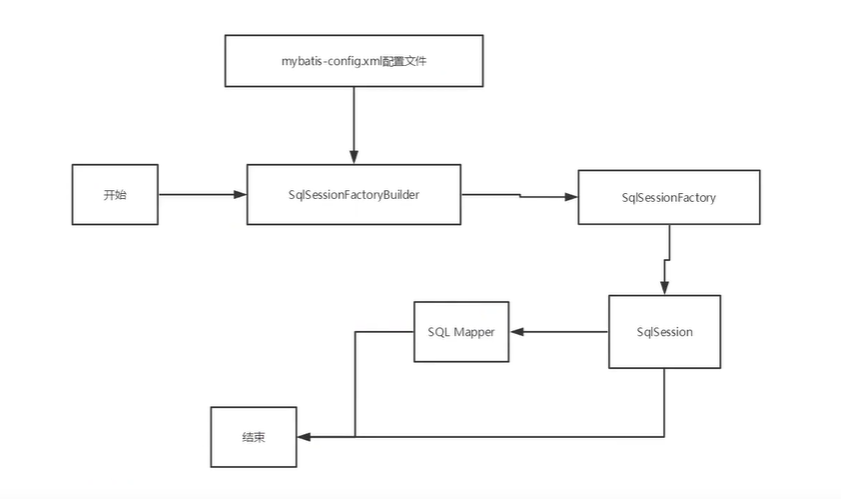

生命周期，和作用域，是至关重要的，因为错误的使用会导致非常严重的**并发问题。**

**SqlSessionFactoryBuilder:**

- 一旦创建了SqISessionFactory, 就不再需要它了
- 局部变量

**SqlSessionFactory:**

- 说白了就是可以想象为:数据库连接池
- SqISessionFactory - -旦被创建就应该在应用的运行期间一-直存在，**没有任何理由丢弃它或重新创建
  另一个实例。**
- 因此SqlSessionFactory的最佳作用域是应用作用域。
- 最简单的就是使用**单例模式**或者静态单例模式。

**SqlSession**

- 连接到连接池的一个请求!
- SqISession 的实例不是线程安全的，因此是不能被共享的，所以它的最佳的作用域是请求或方法作用
  域。
- 用完之后需要赶紧关闭，否则资源被占用!

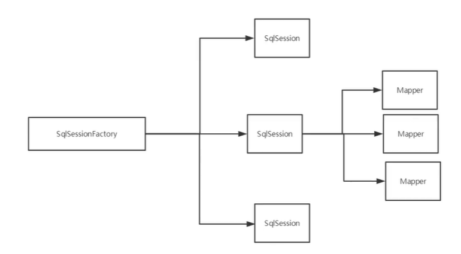

这里面的每一个Mapper, 就代表一个具体的业务 !

## 5、解决属性名和字段名不一致的问题

### 5.1、问题

数据库中的字段

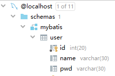

新建一个项目，拷贝之前的,测试实体类字段不一致的情况

```java
public class User {
    private int id;
    private String name;
    private String password;
}
```

测试出现问题(查询结果)


解决方法:

1.起别名

```xml
 <select id="getUserById" parameterType="int" resultType="User">
      select id, name, pwd as password from mybatis.user where id = #{id}
 </select>
```

### 5.2、resultMap

结果集映射

```
id    name    pwd
id    name    password
 <!--结果集映射-->
    <resultMap id= "UserMap" type="User">
        <!--coLumn 数据库中的字段，property 实体类中的属性-->
        <result column="id" property="id"/>
        <result column="name" property="name"/>
        <result column="pwd" property= "password"/>
    </resultMap>

    <select id="getUserById" parameterType="int" resultMap="UserMap">
        select id, name, pwd from mybatis.user where id = #{id}
    </select>
```

- resultMap 元素是MyBatis中最重要最强:大的元素
- ResultMap 的设计思想是，对于简单的语句根本不需要配置显式的结果映射，而对于复杂- -点的语句
  只需要描述它们的关系就行了。
- Resu1tmap 最优秀的地方在于,虽然你已经对它相当了解了，但是根本就不需要显式地用到他们。
- 如果世界总是这么简单就好了。

## 6、日志

### 6.1、日志工厂

如果一个数据库操作,出现了异常,我们需要排错。日志就是最好的助手!

曾经: sout. debug

现在:日志工厂!


- SLF4J
- LOG4J [掌握]
- L0G4J2
- JDK_ LOGGING
- COMMONS_ LOGGING
- STDOUT_ *LOGGING [掌握]*
- *NO* LOGGING

在Mybatis中具体使用哪个- -日志实现，在设置中设定!

**STDOUT_ LOGGING标准日志输出**

在mybatis核心配置文件中，配置我们的日志!

```xml
 <!--设置日志打印,标准的日志工场实现-->
    <settings>
        <setting name="logImpl" value="STDOUT_LOGGING"/>
    </settings>
```

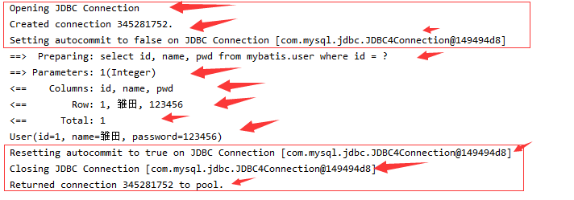

### 6.2、Log4j

什么是Log4j?

●Log4j是Apache的一个开源项目，通过使用Log4j,我们可以控制日志信息输送的目的地是控制台、文件、
GUI组件

●我们也可以控制每一条日志的输出格式;

●通过定义每-条日志信息的级别，我们能够更加细致地控制日志的生成过程。

●通过一个配置文件来灵活地进行配置，而不需要修改应用的代码。

1.导入log4j的包

```xml
 <!-- log4j -->
        <!-- https://mvnrepository.com/artifact/log4j/log4j -->
        <dependency>
            <groupId>log4j</groupId>
            <artifactId>log4j</artifactId>
            <version>1.2.17</version>
        </dependency>
```

2.log4i.properties

```properties
#将等级为DEBUG的日志信息输出到console file这两个目的地。console 矿file的定义在下面的代码
log4j.rootLogger=DEBUG,console,file
#控制台输出的相关设置
log4j.appender.console=org.apache.log4j.ConsoleAppender
log4j.appender.console.Target = System.out
log4j.appender.console.Threshold=DEBUG
log4j.appender.console.layout = org.apache.log4j.PatternLayout
log4j.appender.console.layout.ConversionPattern=[%c]-%m%n

#文件输出的相关设置
log4j.appender.file = org.apache.log4j.RollingFileAppender
log4j.appender.file.File=./log/xibei.log
log4j.appender.file.MaxFileSize=10mb
log4j.appender.file.Threshold=DEBUG
log4j.appender.file.layout=org.apache.log4j.PatternLayout
log4j.appender.file.layout.ConversionPattern=[%p][%d{yy-MM-dd}][%c]%m%n

#日志输出级别
log4j.logger.org.mybatis=DEBUG
log4j.logger.java.sql=DEBUG
log4j.logger.java.sql.Statement=DEBUG
log4j.logger.java.sql.ResultSet=DEBUG
log4j.1ogger.java.sql.PreparedStatement=DEBUG
```

3.配置log4j为日志的实现

```xml
<!--设置日志打印-->
    <settings>
        <setting name="logImpl" value="LOG4J"/>
    </settings>
```

4.Log4j的使用!，直接则试运行刚才的查询


**简单使用**

1.在要使用Log4j的类中，导入包import org.apache.log4j.Logger;

2.日志对象，参数为当前类的class

```java
 static Logger logger = Logger.getLogger(UserMapperTest.class);
```

3.日志级别

```java
   logger.info("info:进入了testLog4j");
   logger.debug("debug:进入了testLog4j");
   logger.error("error:进入了testLog4j");
```

## 7、分页

**思考:为什么要分页?**

减少数据的处理量

### 7.1、使用Limit分页语法

```mysql
1 SELECT * from user limit startIndex ，pagesize;
2 SELECT * from user 1imit 3; #[0,n]
```

使用Mybatis实现分页,核心SQL
1.接口

```java
 //分页
  List<User> getUserByLimit (Map<String, Integer> map);
```

2.Mapper.XML

```xml
<!--//分页-->
    <select id="getUserByLimit" parameterType="map" resultMap="UserMap">
        select*from mybatis.user limit #{startIndex}, #{pageSize}
    </select>
```

3.测试

```java
  @Test
    public void getUserByLimit() {
        SqlSession sqlSession = MybatisUtil.getSqlSession();
        UserMapper mapper = sqlSession.getMapper(UserMapper.class);
        HashMap<String, Integer> map = new HashMap<String, Integer>();
        map.put("startIndex", 0);
        map.put("pageSize", 2);
        List<User> userlist = mapper.getUserByLimit(map);
        for (User user : userlist) {
            System.out.println(user);
        }
        sqlSession.close();
    }
```

### 7.2、RowBounds分页

不再使用SQL实现分页，通过Java代码层面实现分页

1.接口

```java
//分页2.使用RowBounds
List<User> getUserByRowBounds();
```

2.Mapper.XML

```xml
	<!--//分页2-->
    <select id="getUserByRowBounds" resultMap="UserMap">
        select*from mybatis.user;
    </select>
```

3.测试

```java
  @Test
    public void getUserByRowBounds() {
        SqlSession sqlSession = MybatisUtil.getSqlSession();
        //RowBounds实现
        RowBounds rowBounds = new RowBounds(1, 2);
        //通过Java代码层面实现分页
        List<User> userList =
                sqlSession.selectList("com.lenovo.dao.UserMapper.getUserByRowBounds", null, rowBounds);
        for (User user : userList) {
            System.out.println(user);
        }
        sqlSession.close();
    }
```

### 7.3、分页插件

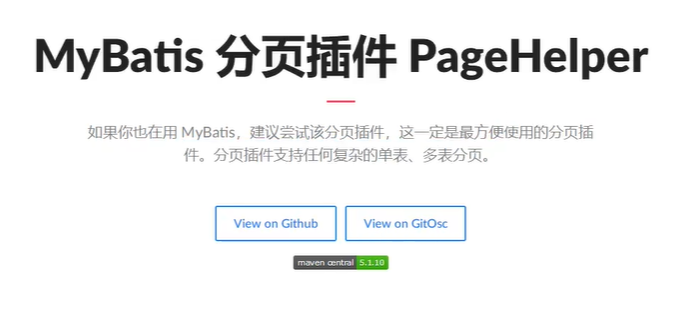

了解即可，万一以后公司的架构师，说要使用，你需要知道它是什么东西.

## 8、使用注解开发

### 8.1、面向接口编程

- 大家之前都学过面向对象编程,也学习过接口，但在真正的开发中，很多时候我们会选择面向接口编程
- **根本原因:解耦,可拓展，提高复用,分层开发中,上层不用管具体的实现,大家都遵守共同的标准,使得开发变得容易，规范性更好**
- 在一个面向对象的系统中，系统的各种功能是由许许多多的不同对象协作完成的。在这种情况下，各个对象内部是如何实现自己的,对系统设计人员来讲就不那么重要了;
- 而各个对象之间的协作关系则成为系统设计的关键。小到不同类之间的通信，大到各模块之间的交互,在系统设计之初都是要着重考虑的，这也是系统设计的主要工作内容。面向接口编程就是指按照这种思想来编程。

关于接口的理解

- 接口从更深层次的理解,应是定义(规范,约束)与实现(名实分离的原则)的分离。
- 接口的本身反映了系统设计人员对系统的抽象理解。

接口应有两类:

- 第一类是对一个个体的抽象，它可对应为一一个抽象体(abstract class);
- 第二类是对一个个体某-方面的抽象，即形成一一个抽象面(interface) ;
- 一个体有可能有多个抽象面。抽象体与抽象面是有区别的。

三个面向区别

- 面向对象是指,我们考虑问题时，以对象为单位，考虑它的属性及方法.
- 面向过程是指，我们考虑问题时，以-个具体的流程(事务过程)为单位,考虑它的实现.
- 接口设计与非接口设计是针对复用技术而言的，与面向对象(过程) 不是一个问题. 更多的体现就是对系统整体的架构

### 8.2、使用注解开发

1.注解在接口上实现

```java
//查询全部用户信息
    @Select("select * from user")
    List<User> getUserList();
```

2.需要再核心配置文件中绑定接口!

```xml
<mappers>
     <!--绑定按口-->
      <mapper class="com.lenovo.dao.UserMapper"/>
</mappers>
```

3.测试

```java
  @Test
    public void test() {
        SqlSession sqlSession = MybatisUtil.getSqlSession();
        System.out.println(sqlSession);
        List<User> userlist = sqlSession.getMapper(UserMapper.class).getUserList();
        for (User user : userlist) {
            System.out.println(user);
        }
        sqlSession.close();
    }
```

**本质:反射机制实现**
**底层:动态代理!**

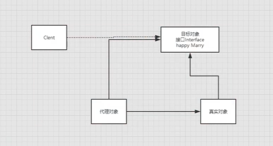

### 8.3、Mybatis执行流程剖析

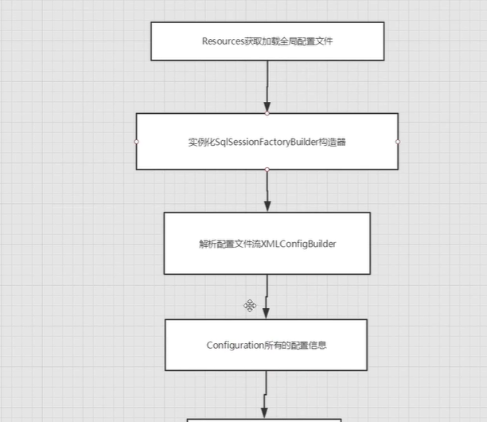

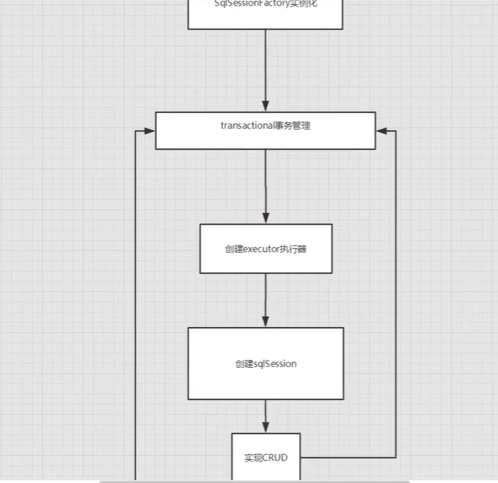

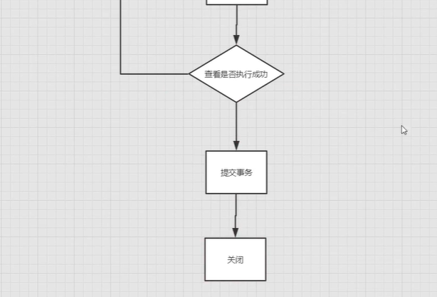

### 8.4、CRUD

1.我们可以在工具类创建的时候实现自动提交事务!MybatisUtil.java

```java
  sqlsession = sqlSessionFactory.openSession(true);
```

2.编写接口，增加注解

```java
//查询全部用户信息
    @Select("select * from user")
    List<User> getUserList();

    //方法存在多个参数，所有的参数前面必须加上@Param( "id")注解,相当于限制了查询名字
    @Select("select * from user where id = #{id2}")
    User getUserByID(@Param("id2") int id);

    @Insert("insert into user(id, name ,pwd) values (#{id}, #{name}, #{password})")
    int addUser(User user);
    @Update("update user set name=#{name}, pwd=#{password} where id = #{id}")
    int updateUser(User user);
    @Delete("delete from user where id = #{uid}")
    int deleteUser(@Param("uid") int id);
```

测试类
[注意:我们必须要讲接口注册绑定到我们的核心配置文件中! ]

```java
package test;

import com.lenovo.dao.UserMapper;
import com.lenovo.pojo.User;
import com.lenovo.util.MybatisUtil;
import org.apache.ibatis.session.SqlSession;
import org.junit.Test;

import java.util.List;

public class UserMapperTest {
    @Test
    public void test() {
        SqlSession sqlSession = MybatisUtil.getSqlSession();
        System.out.println(sqlSession);
        List<User> userlist = sqlSession.getMapper(UserMapper.class).getUserList();
        for (User user : userlist) {
            System.out.println(user);
        }
        sqlSession.close();
    }

    @Test
    public void getUserByID() {
        SqlSession sqlSession = MybatisUtil.getSqlSession();
        User user = sqlSession.getMapper(UserMapper.class).getUserByID(1);
        System.out.println(user);
        sqlSession.close();
    }

    @Test
    public void addUser() {
        SqlSession sqlSession = MybatisUtil.getSqlSession();
        sqlSession.getMapper(UserMapper.class).addUser(new User(4, "琳", "123456"));
        sqlSession.close();
    }

    @Test
    public void updateUser() {
        SqlSession sqlSession = MybatisUtil.getSqlSession();
        sqlSession.getMapper(UserMapper.class).updateUser(new User(4,"红","123456"));
        sqlSession.close();
    }


    @Test
    public void deleteUser() {
        SqlSession sqlSession = MybatisUtil.getSqlSession();
        sqlSession.getMapper(UserMapper.class).deleteUser(6);
        sqlSession.close();
    }
}
```

**关于@Param()注解**

- 基本类型的参数或者String类型，需要加上
- 引用类型不需要加
- 如果只有一个基本类型的话，可以忽略,但是建议大家都加上!
- 我们在SQL中引用的就是我们这里的@Param()中设定的属性名!

**#{} ${} 区别**

编译和预编译（不安全）

## 9、Lombok（小辣椒）

使用步骤:
1.在IDEA中安装Lombok插件!

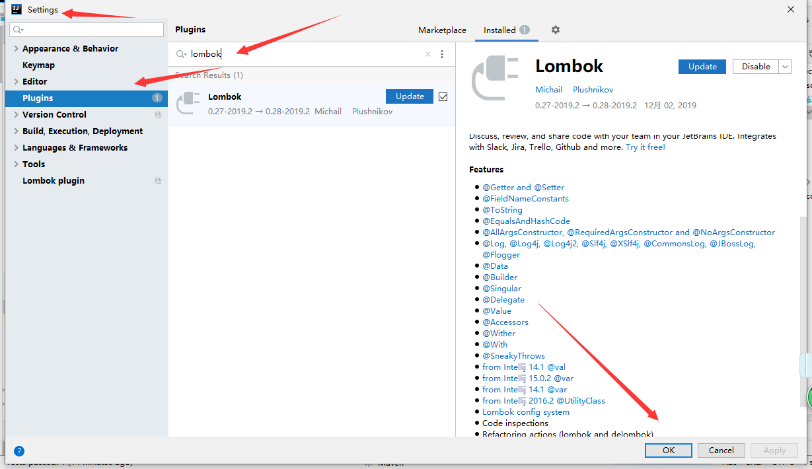

2.在项目中导入lombok的jar包

```xml
 <dependency>
            <groupId>org.projectlombok</groupId>
            <artifactId>lombok</artifactId>
            <version>1.16.20</version>
        </dependency>
```

3.在实体类上加注解即可!

> @Getter and @Setter
> @FieldNameConstants
> @ToString
> @EqualsAndHashCode
> @AllArgsConstructor, @RequiredArgsConstructor and @NoArgsConstructor
> @Log, @Log4j, @Log4j2, @Slf4j, @XSlf4j, @CommonsLog, @JBossLog, @Flogger
> @Data
> @Builder
> @Singular
> @Delegate
> @Value
> @Accessors
> @Wither
> @With
> @SneakyThrows

说明:

> @Data:无参构造，get、 set、tostring、hashcode, equals
> @AllArgsConstructor
> @NoArgsConstructor
> @EqualsandHashCode
> @ToString
> @Getter

## 10、 多对一处理

多对一:

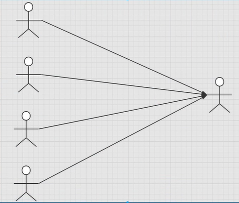

●多个学生,对应一个老师.
●对于学生这边而言， 关联..多个学生,关联-一个老师 [多对一]
●对于老师而言，集合，-一个老师，有很多学生[- 对多]

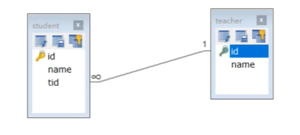

SQL:

```mysql
CREATE TABLE teacher (
id INT(10) NOT NULL,
name VARCHAR (30) DEFAULT NULL,
PRIMARY KEY (id)
ENGINE= INNODB DEFAULT CHARSET=utf8
);

INSERT INTO teacher( id,name ) VALUES (1,秦老师);

create table  student(
id int(10) not null, 
name varchar(30) default null,
tid int(10) default null,
primary  key  (id),
key fktid (tid),
constraint fktid foreign key(tid) references teacher(id)
);

INSERT INTO student(id,name,tid) VALUES ('1','小明','1');
INSERT INTO student(id,name,tid) VALUES ('2','小红','1');
INSERT INTO student(id,name,tid) VALUES ('3','小张','1');
INSERT INTO student(id,name,tid) VALUES ('4','小李','1');
INSERT INTO student(id,name,tid) VALUES ('5','小王','1');
```

### 测试环境搭建

1.导入lombok
2.新建实体类Teacher, Student
3.建立Mapper接口
4.建立Mapper.XML文件
5.在核心配置文件中绑定注册我们的Mapper接口或者文件! [方式很多, 随心选]
6.测试查询是否能够成功!

### 按照查询嵌套处理

```xml
<!--思路:
1.查询所有的学生信息
2.根据查询出来的学生的tid.寻找对应的老师! 子查询
-->
    <select id="getStudent" resultMap="StudentTeacher">
       select * from student
    </select>
    <resultMap id="StudentTeacher" type="Student" >
        <result property="id" column="id"/>
        <result property="name" column="name"/>
    <!--复杂的属性，我们需要单独处理.  对象:association集合: collection -->
        <association property="teacher" column="tid" javaType="Teacher" select="getTeacher"/>
    </resultMap>
    <select id="getTeacher" resultType="Teacher">
        select * from teacher where id = #{tid}
    </select>
```

### 按照结果嵌套处理

```xml
<!--按照结朵成套处理-->
    <select id="getStudent2" resultMap="StudentTeacher2">
        select s.id sid,s.name sname,t.name tname
        from student s, teacher t
        where s.tid = t.id;
    </select>
    <resultMap id="StudentTeacher2" type="Student">
        <result property="id" column="sid"/>
        <result property="name" column="sname"/>
        <association property="teacher" javaType="Teacher">
            <result property="name" column="tname"/>
        </association>
    </resultMap>
//查询所有的学生信息，以及对应的老师的信息!
    List<Student> getStudent();

    List<Student> getStudent2();
  @Test
    public void getStudent() {
        SqlSession sqlSession = MybatisUtil.getSqlSession();
        List<Student> students = sqlSession.getMapper(StudentMapper.class).getStudent();
        for (Student student : students) {
            System.out.println(student);
        }
        //一定要关闭（重点）
        sqlSession.close();
    }

    @Test
    public void getStudent2() {
        SqlSession sqlSession = MybatisUtil.getSqlSession();
        List<Student> students = sqlSession.getMapper(StudentMapper.class).getStudent2();
        for (Student student : students) {
            System.out.println(student);
        }
        //一定要关闭（重点）
        sqlSession.close();
    }
```

回顾Mysql多对一查询方式:

- 子查询
- 联表查询

## 11、一对多处理

比如: 一个老师拥有多个学生!

对于老师而言，就是一对多的关系!

1.环境搭建，和刚才一样、

**实体类**

```java
@Data
public class Student {
    private int id;
    private String name;
    private int tid;

}
@Data
public class Teacher {
    private int id;
    private String name;
    //一个老师拥有多个学生
    private List<Student> students;

}
```

### 11.1、按照结果嵌套处理

Teachermapper

```java
public interface TeacherMapper {
    // List<Teacher> getTeacher();
    //获取指定老师下的所有学生及老师的信息
    Teacher getTeacher(@Param("tid") int id);

    Teacher getTeacher2(@Param("tid") int id);
}
```

Teachermapper.xml

```xml
<?xml version="1.0" encoding="UTF-8" ?>
<!DOCTYPE mapper
        PUBLIC "-//mybatis.org//DTD Mapper 3.0//EN"
        "http://mybatis.org/dtd/mybatis-3-mapper.dtd">
<mapper namespace="com.lenovo.dao.TeacherMapper">
    <select id="getTeacher" resultMap="TeacherStudent">
       select s.id sid, s.name sname, t.name tname,t.id tid
       from student S, teacher t
       where s.tid = t.id and t.id=#{tid}
   </select>

    <resultMap id="TeacherStudent" type="Teacher">
        <result property="id" column="tid"/>
        <result property="name" column="tname"/>
        <!-- 复杂的属性，我们需要单独处理对象: association 集合: collection
 javaType=""指定属性的类型!
 集合中的泛型信息，我们使用ofType获取-->
        <collection property="students" ofType="Student">
            <result property="id" column="sid"/>
            <result property="name" column="sname"/>
            <result property="tid" column="tid"/>
        </collection>
    </resultMap>
</mapper>
```

Test

```java
public class TeacherMapperTest {
    @Test
    public void Test() {
        SqlSession sqlSession = MybatisUtil.getSqlSession();
        TeacherMapper mapper = sqlSession.getMapper(TeacherMapper.class);
        Teacher teacher = mapper.getTeacher(1);
        System.out.println(teacher);
        /*
        Teacher(id=1,
        name=秦老师,
        students=[Student(id=1, name=小明, tid=1), Student(id=2, name=小红, tid=1), Student(id=3, name=小张, tid=1), Student(id=4, name=小李, tid=1), Student(id=5, name=小王, tid=1)])
        */
        sqlSession.close();
    }

    @Test
    public void Test2() {
        SqlSession sqlSession = MybatisUtil.getSqlSession();
        TeacherMapper mapper = sqlSession.getMapper(TeacherMapper.class);
        Teacher teacher = mapper.getTeacher2(1);
        System.out.println(teacher);
        /*
       Teacher(id=0, 
       name=秦老师, 
       students=[Student(id=1, name=小明, tid=1), Student(id=2, name=小红, tid=1), Student(id=3, name=小张, tid=1), Student(id=4, name=小李, tid=1), Student(id=5, name=小王, tid=1)])
        */
        sqlSession.close();
    }
}
```

### 11.2、按照查询嵌套处理

Teachermapper.xml

```xml
<!--按照查询嵌套处理-->
    <select id="getTeacher2" resultMap="TeacherStudent2">
        select * from mybatis.teacher where id = #{tid}
    </select>
    <resultMap id="TeacherStudent2" type="Teacher">
        <collection property="students" javaType="ArrayList" ofType="Student" select="getStudentByTeacherId" column="id"/>
    </resultMap>
    <select id="getStudentByTeacherId" resultType="Student">
        select * from mybatis.student where tid = #{tid}
    </select>
```

**小结**

1.关联- association [多对一 ]

2.集合- collection [一对多]

1. javaType & ofType
2. JavaType用来指定实体类中属性的类型
3. ofType用来指定映射到List或者集合中的pojo类型，泛型中的约束类型!

注意点:

●保证SQL的可读性，尽量保证通俗易懂
●注意对多和多对一-中，属性名和字段的问题!
●如果问题不好排查错误，可以使用日志，建议使用Log4j

**慢SQL 1s 1000s**

**面试高频**

●Mysq|引擎
●InnoDB底层原理
●索引
●引优化!

## 12、 动态SQL

**什么是动态SQL:动态SQL就是指根据不同的条件生成不同的SQL语句**

利用动态SQL这一特性可以彻底摆脱这种痛苦。

```
动态SQL元素和JSTL或基于类似XML的文本处理器相似。在MyBatis之前的版本中，有很多元素需要花时间
了解。MyBatis 3大大精简了元素种类，现在只需学习原来一半的元素便可。MyBatis采用功能强大的基于OGNL
的表达式来淘汰其它大部分元素。


if
choose (when， otherwise)
trim (where, set)
foreach
```

### 12.1、搭建环境

```mysql
CREATE TABLE `blog` (
id varchar(50) NOT NULL,
`title` varchar(100) NOT NULL,
`author` varchar(30) NOT NULL,
`create_time` datetime NOT NULL,
`views` int(30) NOT NULL
)
```

创建一个基础工程
1.导包
2.编写配置文件
3.编写实体类

```java
@Data
public class Blog {
    private String id;
    private String title;
    private String author;
    private Date createTime;
    private int views;
}
```

4.编写实体类对应Mapper接口和Mapper.XML文件

```java
public interface BlogMapper {
    //插入数据
    int addBlog(Blog blog);

    //查询博客
    List<Blog> queryBlogIF(Map map);

    //查询博客
    List<Blog> queryBlogChoose(Map map);

    //更新博客
    int updateBlog(Map map);

    //查询第1-2-3号记录的博客
    List<Blog> queryBlogForeach(Map map);
}
```

mybatis-config.xml中

```xml
<settings>
        <!--设置日志打印-->
        <setting name="logImpl" value="STDOUT_LOGGING"/>
        <!--是否开启自动驼峰命名规则(camel case)映射,将数据库中create_time字段自动转化为createTime-->
        <setting name="mapUnderscoreToCamelCase" value="true"/>
    </settings>
```

### 12.2、IF

Mapper.XML

```xml
<?xml version="1.0" encoding="UTF-8" ?>
<!DOCTYPE mapper
        PUBLIC "-//mybatis.org//DTD Mapper 3.0//EN"
        "http://mybatis.org/dtd/mybatis-3-mapper.dtd">
<mapper namespace="com.lenovo.dao.BlogMapper">
    <insert id="addBlog" parameterType="blog">
        insert into blog (id, title, author, create_time, views)
        values (#{id},#{title},#{author},#{createTime},#{views});
    </insert>

    <select id="queryBlogIF" parameterType="map" resultType="blog">
        select * from mybatis.blog where 1=1
        <if test="title != null">
            and title = #{title}
        </if>
        <if test="author != null">
            and author = #{author}
        </if>
    </select>

</mapper>
```

Test

```java
public class MyTest {
    @Test
    public void addInitBlog() {
        SqlSession session = MybatisUtil.getSqlSession();
        BlogMapper mapper = session.getMapper(BlogMapper.class);
        Blog blog = new Blog();
        blog.setId(IDutils.getId());
        blog.setTitle("Mybatis如此简单");
        blog.setAuthor("狂神说");
        blog.setCreateTime(new Date());
        blog.setViews(9999);
        mapper.addBlog(blog);

        blog.setId(IDutils.getId());
        blog.setTitle("Java如此简单");
        mapper.addBlog(blog);

        blog.setId(IDutils.getId());
        blog.setTitle("Spring如此简单");
        mapper.addBlog(blog);

        blog.setId(IDutils.getId());
        blog.setTitle("微服务如此简单");
        mapper.addBlog(blog);

        session.close();
    }

    @Test
    public void queryBlogIF() {
        SqlSession sqlSession = MybatisUtil.getSqlSession();
        BlogMapper mapper = sqlSession.getMapper(BlogMapper.class);
        HashMap map = new HashMap();
        map.put("title", "Java如此简单");
        map.put("author", "狂神说");
        List<Blog> blogs = mapper.queryBlogIF(map);
        for (Blog blog : blogs) {
            System.out.println(blog);
        }
        sqlSession.close();
    }

}
```

### 12.3、Where

当and 不需要时，可自动帮我们省略

```xml
<select id="queryBlogIF" parameterType="map" resultType="blog">
        select * from mybatis.blog
        <where>
            <if test="title != null">
                title = #{title}
            </if>
            <if test="author != null">
                and author = #{author}
            </if>
        </where>
    </select>
```

### 12.4、choose (when otherwise)

只会选择符合的一个条件

```xml
select id="queryBlogChoose" parameterType= "map" resultType="blog">
        select*from mybatis.blog
        <where>
            <choose>
                <when test="title != null">
                    title = #{title}
                </when>
                <when test="author != null">
                    and author = #{author}
                </when>
                <otherwise>
                    and views = #{views}
                </otherwise>
            </choose>
        </where>
    </select>
```

### 12.5、set

set元素会动态前置SET关键字，同时也会删掉无关的逗号

```xml
<update id="updateBlog" parameterType="map">
        update mybatis.blog
        <set>
            <if test="title != null">
                title = #{title},
            </if>
            <if test="author != nu1l">
                author = #{author}
            </if>
        </set>
        where id = #{id}
    </update>
```

### 12.6、trim (where， set)

前缀，前缀覆盖什么，后缀，后缀覆盖什么

它的作用是移除所有指定在prefixOverrides属性中的内容，并且插入prefix属性中指定的内容。

```xml
<update id="updateBlog" parameterType="map">
    
        <trim prefix= "WHERE" prefixOverrides="AND |OR">
        ...
        </trim>
        <trim prefix="" prefixOverrides="" suffix="" suffixOverrides="">
        </trim>

    </update>
```

**所谓的动态SQL，本质还是SQL语句，只是我们可以在SQL层面， 去执行一个逻辑代码**

### 12.7、SQL片段

有的时候，我们可能会将一些功能的部分抽取出来,方便复用!
1.使用SQL标签抽取公共的部分

```xml
<sql id="if-title-author">
        <if test="title != null">
            title = #{title}
        </if>
        <if test="author != null">
            and author = #{author}
        </if>
</sql>
```

2.在需要使用的地方使用Include标签引用即可

```xml
<select id="queryBlogIF" parameterType="map" resultType="blog">
        select * from mybatis.blog
        <where>
            <include refid="if-title-author"></include>
        </where>
    </select>
```

注意事项:

●最好基于单表来定义SQL片段!
●不要存在where标签

### 12.8、Foreach

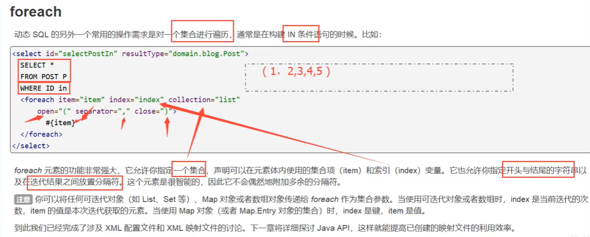


```xml
<!--select * from mybatis.blog where 1=1 and (id=1 or id = 2 or id=3)

    我们现在传递一个万能的map，这map中可以存在一个集合!-->
    <select id="queryBlogForeach" parameterType="map" resultType="blog" >
        select * from mybatis.blog
        <where>
            <foreach collection="ids" item="id" open="and (" close=")" separator= "or">
                id = #{id}
            </foreach>
        </where>
    </select>
```

Test

```java
 @Test
    public void queryBlogForEach() {
        SqlSession sqlSession = MybatisUtil.getSqlSession();
        BlogMapper mapper = sqlSession.getMapper(BlogMapper.class);
        HashMap map = new HashMap();
        ArrayList<Integer> ids = new ArrayList();
        ids.add(1);
        ids.add(2);
        ids.add(3);
        map.put("ids", ids);
        List<Blog> blogs = mapper.queryBlogForeach(map);
        for (Blog blog : blogs) {
            System.out.println(blog);
            sqlSession.close();
        }
    }
```

**动态SQL就是在拼接SQL语句，我们只要保证SQL的正确性，按照SQL的格式，去排列组合就可以了**

建议:
●现在MysqI中写出完整的SQL,再对应的去修改成为我们的动态SQL实现通用即可!

## 13、缓存

### 13.1、简介

```repl
查询: 连接数据库，耗资源!
一次查询的结果，给他暂存在一个可以直接取到的地方! -->内存:缓存
我们再次查询相同数据的时候，直接走缓存，就不用走数据库了
```

1.什么是缓存[ Cache ]?

- 存在内存中的临时数据。
- 将用户经常查询的数据放在缓存(内存)中，用户去查询数据就不用从磁盘上(关系型数据库数据文件)查
  询，从缓存中查询,从而提高查询效率,解决了高并发系统的性能问题。

2.为什么使用缓存?

- 减少和数据库的交互次数,减少系统开销,提高系统效率。

3.什么样的数据能使用缓存?

- 经常查询并且不经常改变的数据。[可以使用缓存]

### 13.2、Mybatis缓存

- MyBatis包含一个非常强大的查询缓存特性，它可以非常方便地定制和配置缓存。缓存可以极大的提升查询效
  率。
- MyBatis系统中默认定义了两级缓存: - -级缓存和二级缓存
  - 默认情况下，只有一级缓存开启。 (SqISession级别的缓存, 也称为本地缓存)
  - 二级缓存需要手动开启和配置，他是基于namespace级别的缓存。
  - 为了提高扩展性, MyBatis定义了缓存接口Cache.我们可以通过实现Cache接口来自定义二级缓存

### 13.3、 一级缓存

一级缓存也叫本地缓存: SqISession

- 与数据库同一次会话期间查询到的数据会放在本地缓存中。
- 以后如果需要获取相同的数据，直接从缓存中拿,没必须再去查询数据库;

**测试步骤:**

1.开启日志!

2.测试在一个Sesion中查询两次相同记录

3.查看日志输出

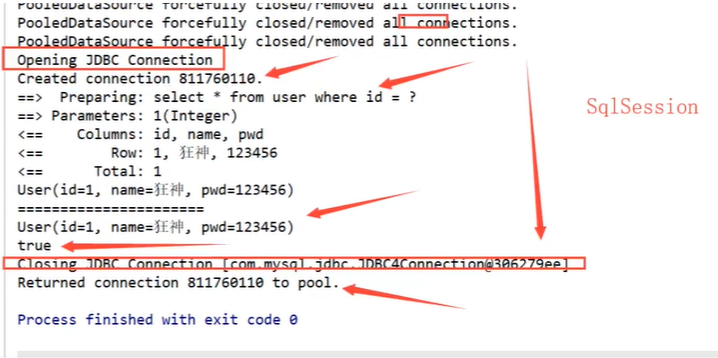

*此为存在缓存情况*

缓存失效的情况:

1.查询不同的东西

2.增删改操作，可能会改变原来的数据，所以必定会刷新缓存!

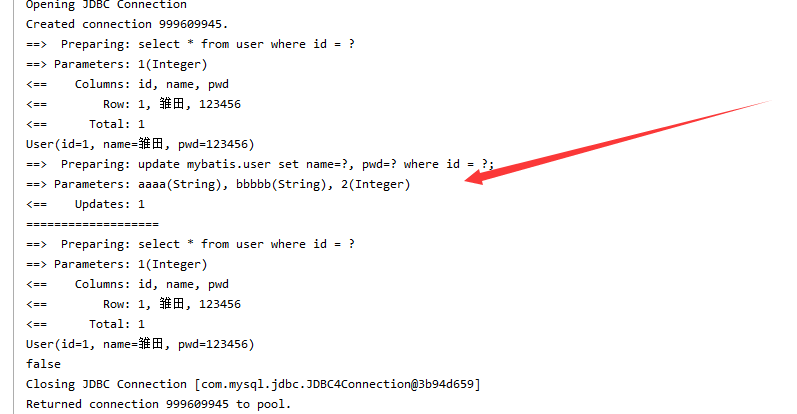

3.查询不同的Mapper.xml

4.手动清理缓存!

```java
public class MyTest {
    @Test
    public void test() {
        SqlSession sqlSession = MybatisUtil.getSqlSession();
        UserMapper mapper = sqlSession.getMapper(UserMapper.class);
        User user = mapper.queryUserById(1);
        System.out.println(user);
        //mapper. updateUser(new User(2, "aaaa", "bbbbb' '));
        sqlSession. clearCache();//手动清理缓存

        System.out.println("===================");
        User user2 = mapper.queryUserById(1);
        System.out.println(user2);
        System.out.println(user == user2);
        sqlSession.close();
    }
```

**小结**:一级缓存默认是开启的， 只在一次SqlSession中有效， 也就是拿到连接到关闭连接这个区间段!
一级缓存就是一个Map

### 13.4、 二级缓存

- 二级缓存也叫全局缓存,一级缓存作用域太低了，所以诞生了二级缓存
- 基于namespace级别的缓存，-个名称空间，对应-个二级缓存;
- 工作机制
  - 一个会话查询一 条数据，这个数据就会被放在当前会话的一级缓存中;
  - 如果当前会话关闭了，这个会话对应的一-级缓存就没了;但是我们想要的是，会话关闭了，- -级缓存中的
    数据被保存到二级缓存中;
  - 新的会话查询信息，就可以从二级缓存中获取内容;
  - 不同的mapper查出的数据会放在自己对应的缓存(map)中;

步骤:
1.开启全局缓存

```xml
  <!--显示的开启全局缓存-->
        <setting name="cacheEnabled" value="true"/>
```

2.在要使用二级缓存的Mapper中开启

```xml
<!--在当前Mapper.xmL中使用二级缓存-->
    <cache/>
```

也可以自定义参数

```xml
 <!--在当前Mapper.xmL中使用二级缓存-->
    <cache eviction="FIFO"
           flushInterval="60000"
           size="512"
           readOnly="true"/>
```

3.测试
1.问题:我们需要将实体类序列化!否则就会报错!

```java
org.apache.ibatis.cache.CacheException: Error serializing object.  Cause: java.io.NotSerializableException: com.lenovo.pojo.User
```

小结:

- 只要开启了二级缓存,在同一个Mapper下就有效
- 所有的数据都会先放在一级缓存中;
- 只有当会话提交,或者关闭的时候，才会提交到二级缓冲中!

### 13.5、 缓存原理

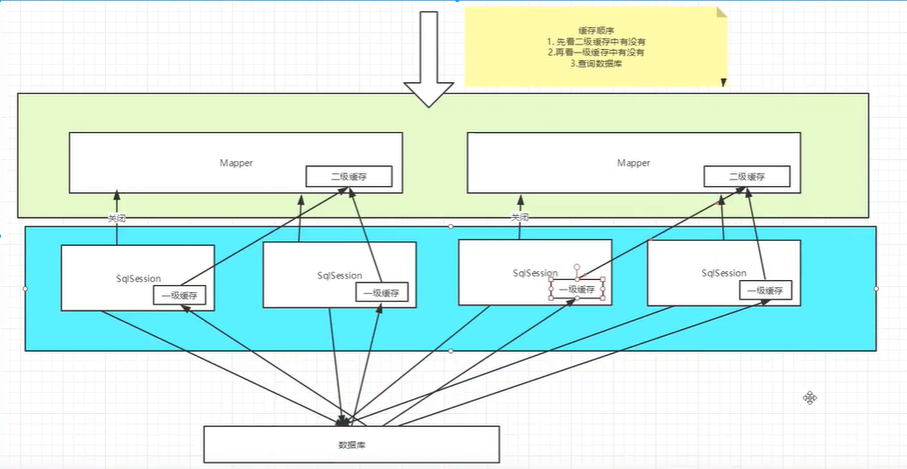

### 13.6、自定义缓存-ehcache

> Ehcache是一种广泛使用的开源Java分布式缓存。主要面向通用缓存

要在程序中使用ehcache,先要导包!

```xml
<!--自定义缓存-->
<!-- https://mvnrepository.com/artifact/org.mybatis.caches/mybatis-ehcache -->
    <dependency>
        <groupId>org.mybatis.caches</groupId>
        <artifactId>mybatis-ehcache</artifactId>
        <version>1.0.3</version>
    </dependency>
```

在mapper中指定使用我们的ehcache缓存实现!

```xml
<!--在当前Mapper.xmL中使用二级缓存-->
    <cache type="org.mybatis.caches.ehcache.EhcacheCache"/>
```

需要增加一个配置文件ehcache.xml

```xml

```

Redis数据库来做缓存! K-V

## 练习: 29道练习题实战!

根据所给接口写配置文件以及测试类，要求测试成功

## 100、MyBatis通用

### 100.1、可能用到的依赖

```xml
<dependencies>
        <!--连接数据库-->
        <dependency>
            <groupId>mysql</groupId>
            <artifactId>mysql-connector-java</artifactId>
            <version>5.1.17</version>
        </dependency>
        <!--单元测试-->
        <dependency>
            <groupId>junit</groupId>
            <artifactId>junit</artifactId>
            <version>4.11</version>
        </dependency>
       <!--使用mybatis框架-->
        <!-- https://mvnrepository.com/artifact/org.mybatis/mybatis -->
        <dependency>
            <groupId>org.mybatis</groupId>
            <artifactId>mybatis</artifactId>
            <version>3.5.2</version>
        </dependency>
       <!--小辣椒-->
        <dependency>
            <groupId>org.projectlombok</groupId>
            <artifactId>lombok</artifactId>
            <version>1.16.20</version>
        </dependency>
        <!-- log4j 日志打印-->
        <!-- https://mvnrepository.com/artifact/log4j/log4j -->
        <dependency>
            <groupId>log4j</groupId>
            <artifactId>log4j</artifactId>
            <version>1.2.17</version>
        </dependency>
        <!--自定义缓存-->
   		<!-- https://mvnrepository.com/artifact/org.mybatis.caches/mybatis-ehcache -->
        <dependency>
            <groupId>org.mybatis.caches</groupId>
            <artifactId>mybatis-ehcache</artifactId>
            <version>1.0.3</version>
        </dependency>
    </dependencies>
```

### 100.2、核心配置文件

#### 100.2.1、db.properties

```properties
driver=com.mysql.jdbc.Driver
url=jdbc:mysql://localhost:3306/mybatis?useSSL=false&useUnicode=true&characterEncoding=utf-8&autoReconnect=true
username=root
password=981204
```

#### 100.2.2、mybatis-config.xml

```xml
<?xml version="1.0" encoding="UTF-8" ?>
<!DOCTYPE configuration
        PUBLIC "-//mybatis.org//DTD Config 3.0//EN"
        "http://mybatis.org/dtd/mybatis-3-config.dtd">
<configuration>
    <!--引入外部配置文件-->
    <properties resource="db.properties">
        <property name="username" value="root"/>
        <property name="password" value="123456"/>
    </properties>

    <settings>
        <!--设置日志打印-->
        <setting name="logImpl" value="STDOUT_LOGGING"/>
        <!--是否开启自动驼峰命名规则(camel case)映射-->
        <setting name="mapUnderscoreToCamelCase" value="true"/>
        <!--显示的开启全局缓存-->
        <setting name="cacheEnabled" value="true"/>
    </settings>

    <!--可以给实体类起别名-->
    <!--  <typeAliases>
          <typeAlias type="com.lenovo.pojo.User" alias="User"/>
      </typeAliases>-->

    <!--给类配置别名 -->
    <typeAliases>
        <package name="com.lenovo.pojo"/>
    </typeAliases>
    <environments default="development">
        <environment id="development">
            <transactionManager type="JDBC"/>
            <dataSource type="POOLED">
                <property name="driver" value="${driver}"/>
                <property name="url" value="${url}"/>
                <property name="username" value="${username}"/>
                <property name="password" value="${password}"/>
            </dataSource>
        </environment>
    </environments>
    <mappers>
        <mapper class="com.lenovo.dao.UserMapper"/>
    </mappers>
</configuration>
```

#### 100.2.3、通用工具类MybatisUtil

```java
package com.lenovo.util;

import org.apache.ibatis.io.Resources;
import org.apache.ibatis.session.SqlSession;
import org.apache.ibatis.session.SqlSessionFactory;
import org.apache.ibatis.session.SqlSessionFactoryBuilder;

import java.io.InputStream;

public class MybatisUtil {
    private MybatisUtil() {}

    public static SqlSession getSqlSession() {
        String resource= "mybatis-config.xml";
        InputStream inputStream = null;
        SqlSession sqlsession = null;
        try {
            //使用Mybatis第一步: 获取sqlSessionFactory对象
            inputStream = Resources.getResourceAsStream(resource);
            SqlSessionFactory sqlSessionFactory = new SqlSessionFactoryBuilder().build(inputStream);
            //既然有了sqlSessionFactory, 顾名思义，我们就可以从中获得sqlsession 的实例了。
            // sqlSession 完全包含了面向数据库执行SQL命令所需的所有方法。
            sqlsession = sqlSessionFactory.openSession(true);
        } catch (Exception e) {
            e.printStackTrace();
        }
        return sqlsession;
    }

    public static void main(String[] args) {
        System.out.println(getSqlSession());
    }

}
```

#### 100.2.4、mapper.xml配置文件

```xml
<?xml version="1.0" encoding="UTF-8" ?>
<!DOCTYPE mapper
        PUBLIC "-//mybatis.org//DTD Mapper 3.0//EN"
        "http://mybatis.org/dtd/mybatis-3-mapper.dtd">
<mapper namespace="com.lenovo.dao.UserMapper">

</mapper>
```

#### 100.2.5、测试类通用

```java
@Test
    public void getUserById() {
        SqlSession sqlSession = MybatisUtil.getSqlSession();
        UserMapper mapper = sqlSession.getMapper(UserMapper.class);
        User user = mapper.getUserById(1);
        System.out.println(user);
        sqlSession.close();
    }
```

### 100.3.可能用到的注解

```java
1: Junit
@Test
2:
@Select()
@Insert()
@Update()
@Delete()
3:
@Param()
4:
@Data
@AllArgsConstructor
@NoArgsConstructor
5：
@SuppressWarnings("all") //抑制警告
```

# MyBatis执行流程

1.先查看个人总结的一张图


2.详细流程

1. 加载全局配置文件（mybatisConfig.xml），这个配置文件中通常是别名设置，拦截器的设置，（当ssm整合后，环境配置与mapper映射文件的注册会转移到spring配置文件中）
2. xml全局配置文件会产生一个构建者类，叫做xmlConfigBuilder，这个类是用来通过xml配置文件来构建COnfiguration对象实例的，构建的过程就是解析（MBatistConfig.xml）配置文件 调用parse产生configuration对象
3. 随后产生的就是Mybatis的配置类，（configuration），这个类可以作为项目的全局配置对象，
4. 接下来便是SqlSessionFactory（会话工厂）的构建者类，（SqlSessionFactoryBuilder），configuration配置对象，就可以调用会话工厂构建者类中的build方法完成对会话工厂对象的构建
5. 产生sqlsessionFactory（会话工厂），是用来生成会话的接口，有一个实现类（DefaultSqlSessionFactory）

，这个实现类是真正的会话 的工厂类，并且他他是单利的。会一直存在到服务器关闭

1. 通过调用会话工厂的实现类中（DefaultSqlSessionFactory）的openSession（）方法完成SqlSession对象的创建
2. 产生sqlSession，该接口是会话，并且是非线程安全的，每一次对数据库的访问都需要创建一个sqlSession，当得到结果后SqlSession就会被废弃。所以声明周期短
3. 当然这当中还有一个Executor执行器接口，这才是内部真正对数据库进行操作的操作者，他才是真正的干事的
4. 另外就是StatementHandler该类是Statment处理器，封装了对数据库各种操作方法，使用的时候，就调用其中的一些方法罢了
5. 最后就是结果集处理器（ResultSetHandler），这个处理器的作用就是对结果进行处理并返回的。（当然这是在有结果返回的情况下，需要对结果集进行处理)