# 新冠-物资管理系统

## 项目简介及核心技术

### 新冠-物资管理系统简介

> SpringBoot+Vue+Element-UI (新冠-物资管理系统) 纯前后端分离项目， 抗疫相关物料的管理系统，领用、派发记录，库存查询统计。 项目预览地址：<https://www.zykhome.club>

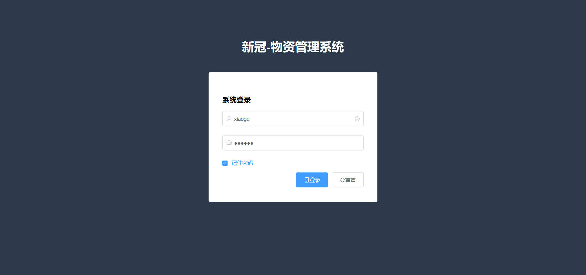

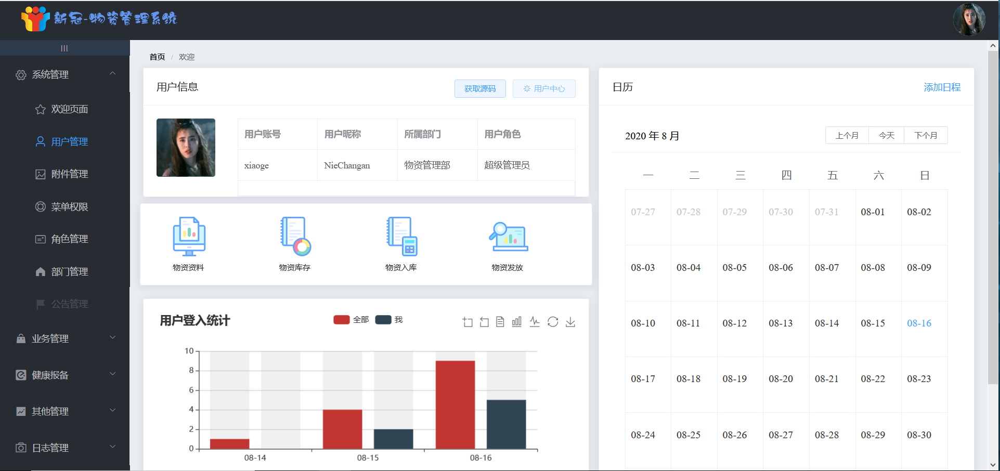

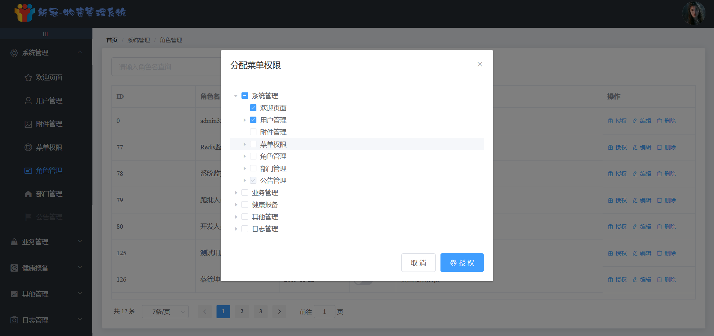

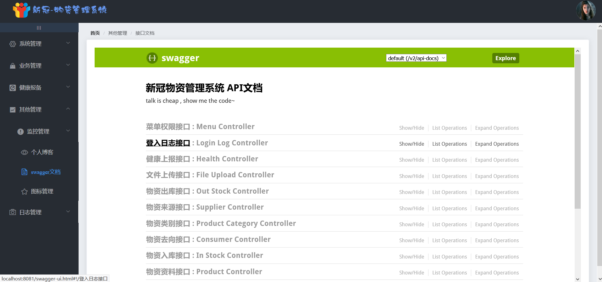

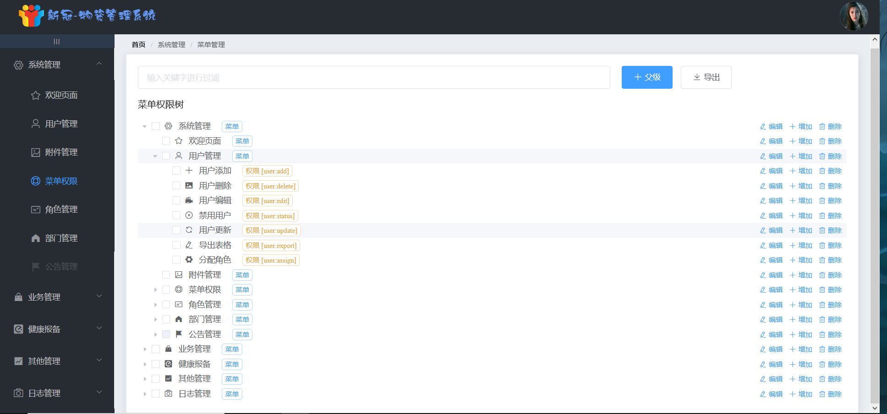

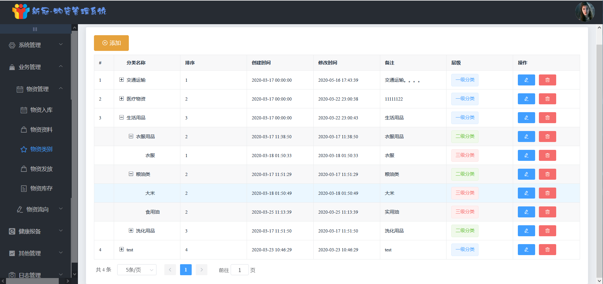

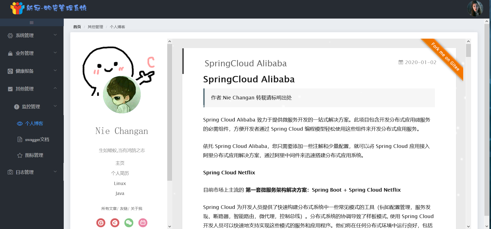

### 技术交流群

- QQ群：1135453115
- 微信号:17670753912 加微信【备注：新冠-物资管理系统】联系作者
- 源码,工具可以通过群下载

### 在线体验

**预览地址**

<https://www.zykhome.club>

 **接口文档** 
<https://www.zykhome.club:8081/swagger-ui.html>

 **后台项目地址** 
<https://github.com/zykzhangyukang/Xinguan>

 **前端项目地址** 
<https://github.com/zykzhangyukang/Vue-Xinguan>

### 核心技术

- 核心框架：Spring Boot2.x
- 权限框架：Spring Security5.x
- 持久层框架：MyBatis-Plus、MyBatis
- 数据库连接池：Alibaba Druid
- 缓存框架：Redis3.x
- 日志管理：LogBack
- 工具类：Apache Commons、HuTools、joda-time
- 视图框架：Spring MVC
- 定时器：Quartz
- 数据库连接池：Druid
- 日志管理：Logback
- 前端框架：Vue
- 前端组件库：Element-UI
- 短信服务：阿里云短信服务
- 分布式文件系统：阿里对象存储OSS
- Excel导入导出：阿里EasyExcel
- API文档：Swagger2
- 数据库：MySQL8
- 版本控制：Git
- 持续集成：Jenkins(暂定)
- 可视化图表：Apache Echarts

### 系统结构

```tex
xinguan-parent //聚合支付
├── xinguan-base-common //通用工具类、配置类
|
├── xinguan-base-web //基础API服务
```

### 学习收获

* 掌握Vue Element 开发后台页面的能力，从而深入理解Vue在后台管理系统中的开发流程； 

* 掌握运用Spring Boot开发后台接口的能力； 

* 掌握Spring Security开发权限管理的能力； 

* 掌握Redis缓存在开发中的运用能力； 

* 最终学会用Vue Element Spring Boot 从零开始搭建前后端分离项目的能力，从而更深入的

  理解系统中整个数据的流向，从哪里来，到哪里去

## 前端项目工具及环境搭建

```tex
丑话说在前面,因为本人是后台开发人员,对前端比较好用的工具不是太熟练,例如 VSCode、webstorm
所以此项目前后端都是使用IDEA进行开发的,不过对于前端开发人员还是推荐使用VSCode,因为提示功能强大,编码效率也随之提高不少
```

### 安装前端工具

[visual studio code 官网下载地址](https://code.visualstudio.com/)

[Node.js中文官网下载地址](https://nodejs.org/zh-cn/download/)

安装过程这里就省略了...

**查看是否安装成功**

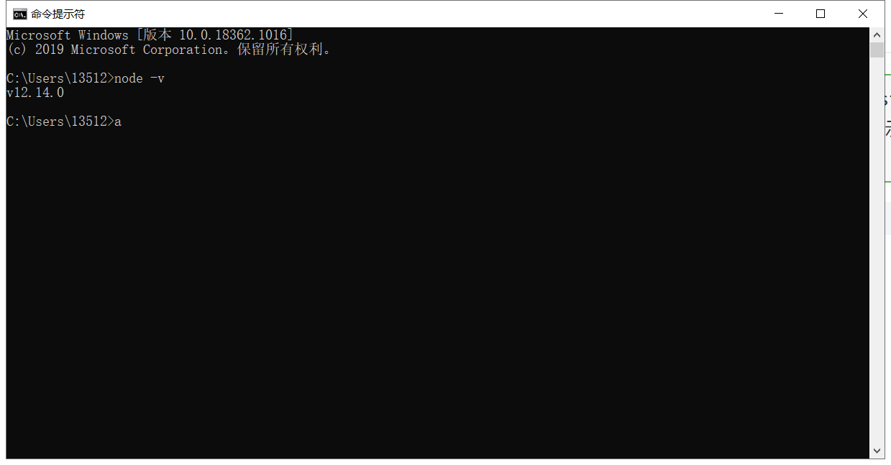

### 安装Vue-Cli脚手架


[Vue CLI脚手架中文官网](https://cli.vuejs.org/zh/)：Vue.js 开发的标准工具

```tex
关于旧版本
Vue CLI 的包名称由 vue-cli 改成了 @vue/cli。 如果你已经全局安装了旧版本的 vue-cli (1.x 或 2.x)，你需要先通过 npm uninstall vue-cli -g 或 yarn global remove vue-cli 卸载它。
```

> **Node 版本要求**
>
> Vue CLI 需要 [Node.js](https://nodejs.org/)[ ](https://nodejs.org/) 8.9 或更高版本 (推荐 8.11.0+)。你可以使用 [nvm](https://github.com/creationix/nvm)[ ](https://github.com/creationix/nvm) 或 [nvm-windows](https://github.com/coreybutler/nvm-windows)[ ](https://github.com/coreybutler/nvm-windows) 在
>
> 同一台电脑中管理多个 Node 版本。

可以使用下列任一命令安装这个新的包：

```bash
npm install -g @vue/cli
# OR
yarn global add @vue/cli
```

安装之后，你就可以在命令行中访问 `vue` 命令。你可以通过简单运行 `vue`，看看是否展示出了一份所有可用命令的帮助信息，来验证它是否安装成功。

你还可以用这个命令来检查其版本是否正确：

```bash
vue --version
```

可以使用vue -V查看版本

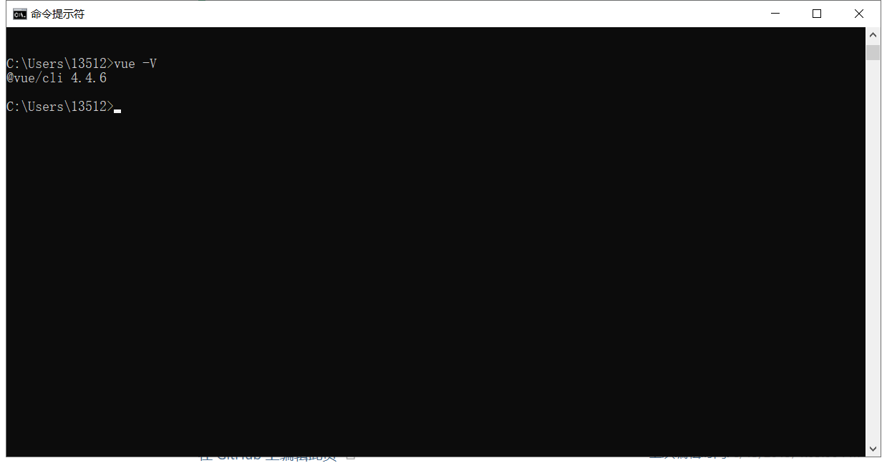

### 创建前端项目

启动vue ui控制台

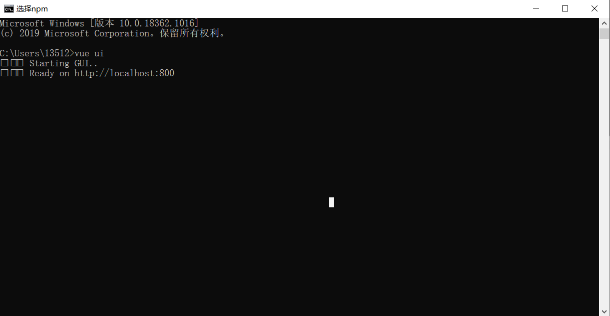

启动之后会自动跳转到浏览器,能看到如下界面:

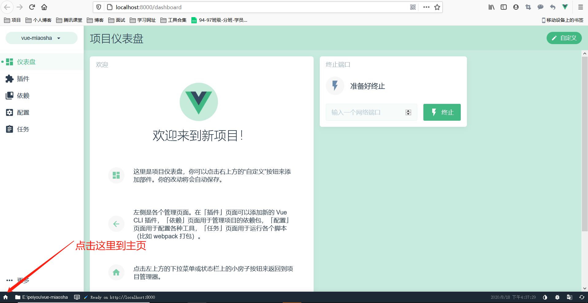

然后创建项目

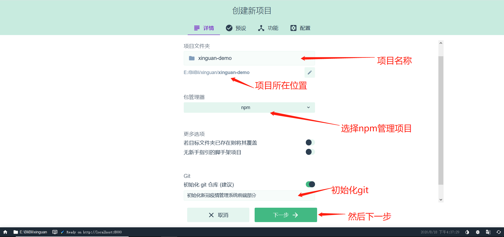

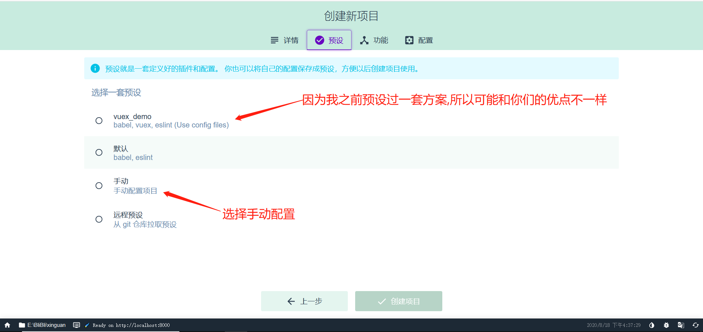

选择手动,然后创建项目就到了如下界面:

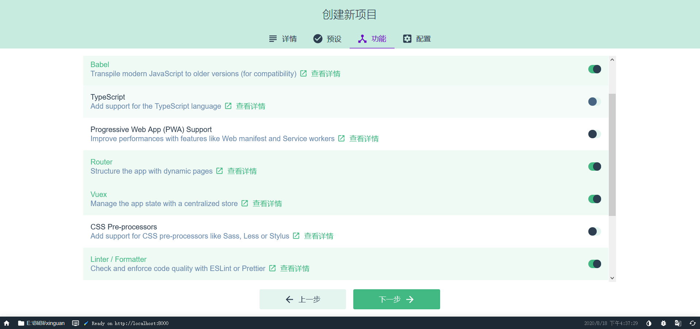

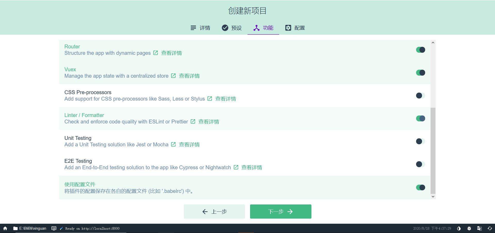

同学们选的和我一样的就行了,还有一个ESLint,你们可以自由选择,反正我是不喜欢那个代码提示,太烦了,我先选上,后面我会取消的,这里我给你们解释一下这些选项是什么意思。

**选项说明**

```html
Babel：将ES6编译成ES5 

TypeScript：使用TypeScript 

Router和Vuex`：路由和状态管理 

Linter/ Formatter：代码检查工具 

CSS Pre-processors：css预编译 
```

然后继续下一步，看到如下页面:


创建项目可能需要点时间,请耐心等待...

在等待的过程中出现了意外,创建项目很久,你们可以回到vue ui小黑板进行手动加速(自己发现的)


在这里可以多敲几次回车,好像会快很多...

项目创建成功之后会跳转到这个界面:


如果能看到如下界面,那么恭喜你,快跟上我的步伐了


ESLint是个很烦的东西,不喜欢的可以把它停掉


将项目导入到IDEA中


### 安装Element UI

[Element UI中文官网](https://element.eleme.cn/#/zh-CN)


**npm安装**

推荐使用 npm 的方式安装，它能更好地和 [webpack](https://webpack.js.org/) 打包工具配合使用。

```shell
#npm安装组件可能比较慢,建议配置国内加速器(这里以淘宝为例)
npm config set registry https://registry.npm.taobao.org/
npm i element-ui -S
```

**引入 Element**

你可以引入整个 Element，或是根据需要仅引入部分组件。我们先介绍如何引入完整的 Element。

**完整引入**

在 main.js 中写入以下内容：

```javascript
import Vue from 'vue';
import ElementUI from 'element-ui';
import 'element-ui/lib/theme-chalk/index.css';
import App from './App.vue';

Vue.use(ElementUI);

new Vue({
  el: '#app',
  render: h => h(App)
});
```

以上代码便完成了 Element 的引入。需要注意的是，样式文件需要单独引入。

当然也可以按需导入,具体参考官网

以下是我的配置:

**main.js**

```javascript
import Vue from 'vue'
import App from './App.vue'
import router from './router'
import ElementUI from 'element-ui';
import 'element-ui/lib/theme-chalk/index.css';
import store from './store'

Vue.use(ElementUI);
Vue.config.productionTip = false

new Vue({
  router,
  store,
  render: h => h(App)
}).$mount('#app')
```

**About.vue**

```vue
<template>
  <div class="about">
    <h1>This is an about page</h1>
    <el-button type="primary">点击有美女</el-button>
  </div>
</template>
```

启动测试:


> 文档由小哥(安哥)原创,禁止商用,有问题可以添加交流群: 1135453115
>
> 作为一个靓仔,我已经喜欢了孤独....

## 登录页面布局

**设置盒子的高度100% ,内边距、外边距为 0**

在assets下新建css的文件夹，文件夹中新建一个global.css文件

**global.css**

```css
/*全局样式表*/
html,body,#app{
    height: 100%;
    margin: 0;
    padding: 0;
}
```

views下新建登录组件Login.vue

**Login.vue**

```vue
<template>

</template>

<script>
  export default {
    name: 'Login'
  }
</script>

<style scoped>

</style>
```

### 安装less-loader

项目中想使用less进行进行样式编辑

```css
<style lang="less" scoped>

</style>
```

直接使用会报错:Can't resolve 'less-loader'

打开项目文件夹，终端命令：

```shell
npm install --save-dev less-loader less
```

如果不想用less，可以将`lang='less'`删除

### 登录页面完整代码

写页面需要同学们有足够的基本功，除了会Vue之外，还要熟练使用Css、Html等基本操作，如果不是很熟练的话可以拷贝我的代码,粘贴即用

**Login.vue**

```vue
<template>
  <!--登录表单的容器-->
  <div class="login_container">
    <!--登录区域-->
    <div class="login_box">
      <!--头像-->
      <div class="avatar_box">
        
      </div>
      <!--表单-->
      <el-form :model="loginForm" :rules="loginRules" ref="loginForm" label-width="0px" class="login_form">
        <el-form-item prop="username">
          <el-input v-model="loginForm.username" placeholder="请输入用户名称" prefix-icon="el-icon-user-solid"></el-input>
        </el-form-item>
        <el-form-item prop="password">
          <el-input v-model="loginForm.password" placeholder="请输入登录密码" prefix-icon="el-icon-lock"></el-input>
        </el-form-item>
        <el-form-item prop="verifyCode">
          <div class="verifyCode_box">
            <el-input v-model="loginForm.verifyCode" placeholder="请输入手机验证码" prefix-icon="el-icon-mobile" class="verifyCode"></el-input>
            
          </div>
        </el-form-item>
        <el-form-item class="login_btn">
          <el-button type="primary" @click="submitForm('loginForm')">立即创建</el-button>
          <el-button @click="resetForm('loginForm')">重置</el-button>
        </el-form-item>
      </el-form>
    </div>
  </div>
</template>

<script>
  export default {
    name: 'Login',
    data() {
      return {
        loginForm: {
          username: '',
          password: '',
          verifyCode: ''
        },
        loginRules: {
          username: [
            { required: true, message: '请输入用户名称', trigger: 'blur' },
            { min: 3, max: 16, message: '长度在 3 到 16 个字符', trigger: 'blur' }
          ],
          password: [
            { required: true, message: '请输入登录密码', trigger: 'blur' },
            { min: 3, max: 16, message: '长度在 3 到 16 个字符', trigger: 'blur' }
          ],
          verifyCode: [
            { required: true, message: '请输入验证码', trigger: 'blur' }
          ]
        }
      };
    },
    methods: {
      submitForm(formName) {
        this.$refs[formName].validate((valid) => {
          if (valid) {
            alert('submit!');
          } else {
            console.log('error submit!!');
            return false;
          }
        });
      },
      resetForm(formName) {
        this.$refs[formName].resetFields();
      }
    }
  }
</script>

<style lang="less" scoped>
  .login_container {
    height: 100%;
    background-color: aquamarine;
  }

  .login_box {
    width: 450px;
    height: 380px;
    background-color: #FFFFFF;
    border-radius: 3px;
    position: absolute;
    left: 50%;
    top: 50%;
    transform: translate(-50%, -50%);

    .avatar_box{
      width: 130px;
      height: 130px;
      border: 1px solid #EEEEEE;
      border-radius: 50%;
      padding: 10px;
      box-shadow: 0 2px 12px 0 rgba(0, 0, 0, 0.1);
      margin: -65px auto;
      background-color: #FFFFFF;

      img{
        width: 100%;
        height: 100%;
        border-radius: 50%;
        background-color: #EEEEEE;
      }
    }

    .login_form{
      position: absolute;
      bottom: 0px;
      width: 100%;
      padding: 0px 20px;
      box-sizing: border-box;

      .login_btn{
        display: flex;
        justify-content: flex-end;
      }

      .verifyCode_box{
        display: flex;
        .verifyCode{
          width: 70%;
          justify-content: left;
        }

        .verifyCode_img{
          width: 30%;
          height: 45px;
          justify-content: flex-end;
        }
      }
    }
  }
</style>
```

### 修改页面布局

项目中`Home.vue`和`About.vue`是多余的可以删除


删除`App.vue`中id为nav的div标签


`App.vue`最终代码

```vue
<template>
  <div id="app">
    <router-view/>
  </div>
</template>

<style>

</style>
```

编辑`router/index.js`文件,整体代码如下

```js
import Vue from 'vue'
import VueRouter from 'vue-router'

Vue.use(VueRouter)

const routes = [
  {
    path: '/',
    redirect: '/login', //重定向到/login
  },
  {
    path: '/login',
    name: 'Login',
    component: () => import('../views/Login.vue')
  }
]

const router = new VueRouter({
  routes
})

export default router
```

再次启动项目会发现点击链接直接跳转到`Login.vue`


## 主界面布局


初步代码如下:

```vue
<template>
  <el-container class="home-container">
<!--    导航-->
    <el-header>
      <div>
        <span style="margin-left:20px;">
          
        </span>
      </div>
      <el-dropdown>
        <div class="block">
          <el-avatar  :size="50" :src="this.userInfo.avatar" style="cursor: pointer;"></el-avatar>
        </div>
        <el-dropdown-menu slot="dropdown" trigger="click">
           <el-dropdown-item>
             <span type="danger"  @click="toWelcome"><span class="el-icon-house"></span> &nbsp;系统首页</span>
          </el-dropdown-item>


          <el-dropdown-item>

            <span type="danger" @click="getContact"><span class="el-icon-ship"></span> &nbsp;交流讨论</span>

          </el-dropdown-item>

          <el-dropdown-item>

            <span type="danger" @click="logout"><span class="el-icon-switch-button"></span> &nbsp;退出登入</span>

          </el-dropdown-item>
        </el-dropdown-menu>
      </el-dropdown>
    </el-header>
    <!--主体-->
    <el-container style="height: 500px;">
      <!--菜单-->
      <el-aside :width="isOpen==true?'64px':'200px'">
        <div class="toggle-btn" @click="toggleMenu">|||</div>
        <el-menu
          class="el-menu-vertical-demo"
          :collapse="isOpen"
          :router="true"
          :default-active="activePath"
          background-color="#272c33"
          :collapse-transition="false"
          text-color="rgba(255,255,255,0.7)"
          unique-opened
        >
          <MenuTree  :menuList="this.menuList"></MenuTree>
        </el-menu>
      </el-aside>

      <!--右边主体-->
      <el-main v-loading="loading">

        <router-view></router-view>

      </el-main>
    </el-container>
  </el-container>
</template>

<script>
import MenuTree from "./MenuTree.vue"; //引进菜单模板

export default {
  data() {
    return {
      loading: true,
      activePath: "", //激活的路径
      isOpen: false,
      menuList: {},
      userInfo: {},

    };
  },
  components: {
    MenuTree
  },
  methods: {
    /**
     *
     * 退出登入
     */
    async logout() {
      var res = await this.$confirm("此操作将退出系统, 是否继续?", "提示", {
        confirmButtonText: "确定",
        cancelButtonText: "取消",
        type: "warning"
      }).catch(() => {
        this.$message({
          type: "info",
          message: "已取消退出登入"
        });
      });
      if (res == "confirm") {
        window.localStorage.clear();
        this.$router.push("/login");
      }
    },
    /**
     * 去系统首页
     */
    toWelcome(){
      this.$router.push("/welcome");
    },
    /**
      加载菜单数据
     */
    async getMenuList() {
      const { data: res } = await this.$http.get("user/findMenu");
      if (res.code !== 200)
        return this.$message.error("获取菜单失败:" + res.msg);
       this.menuList = res.data;
    },
    /**
      获取用户信息
     */
    async getUserInfo() {
      const { data: res } = await this.$http.get("user/info");
      if (res.code !== 200) {
        return this.$message.error("获取用户信息失败:" + res.msg);
      } else {
        this.userInfo = res.data;
        //保存用户
        this.$store.commit("setUserInfo", res.data);
      }
    },
    /**
     * 菜单伸缩
     */
    toggleMenu() {
      this.isOpen = !this.isOpen;
    },

    /**
     * 点击交流
     */
    getContact(){
      const w = window.open('about:blank');
      w.location.href = 'https://www.zykcoderman.xyz/';
    }

  },
  mounted() {
    this.getUserInfo();
  },
  created() {
    this.getMenuList();
    this.activePath = window.sessionStorage.getItem("activePath");
    // if(window.sessionStorage.getItem("activePath")==null){
    //   this.activePath='/welcome';
    // }
    setTimeout(() => {
      this.loading = false;
    }, 500);
  }
};
</script>

<style>
/* 为对应的路由跳转时设置动画效果 */

.el-header {
  background-color: #272c33;
  display: flex;
  justify-content: space-between;
  align-items: center;
  color: #fff;
  font-size: 19px;

  padding-left: 0px;
}
.el-aside {
  background-color:#272c33
}
.el-main {
  background-color: #eaedf1;
}
.home-container {
  width: 100%;
  height: 100% !important;
}
.toggle-btn {
  background-color: #2d3a4b !important;
  font-size: 10px;
  line-height: 24px;
  color: #fff;
  text-align: center;
  letter-spacing: 0.2em;
  cursor: pointer;
}

</style>
```

### 侧边栏布局优化

虽然看上去整体的页面布局没太大问题了,但是我们想一想,菜单栏难道就只有用户列表那两个吗,肯定会有很多数据对不对,而且我们的菜单栏数据肯定是比较庞大的,把所有的内容放一个页面重总感觉不是特别好,所以我们可以将菜单栏部分抽取成一个组件.

创建一个**MenuTree**(菜单树)的组件,将`el-menu`节点下的数据放在**MenuTree**中,具体代码如下

**MenuTree**

```vue
<template>
  <div>
    <template>
      <el-submenu index="1">
        <template slot="title">
          <i class="el-icon-location"></i>
          <span>用户管理</span>
        </template>
        <el-menu-item index="1-1">
          <i class="el-icon-location"></i>
          <span slot="title">用户管理</span>
        </el-menu-item>
      </el-submenu>

      <el-submenu index="2">
        <template slot="title">
          <i class="el-icon-location"></i>
          <span>用户管理</span>
        </template>
        <el-menu-item index="2-1">
          <i class="el-icon-location"></i>
          <span slot="title">用户管理</span>
        </el-menu-item>
      </el-submenu>
    </template>
  </div>
</template>

<script>
  export default {
    name: 'MenuTree'
  }
</script>

<style scoped>

</style>
```

`Main.vue`下el-menu的代码使用**MenuTree**替代,具体操作如下

* 在script标签中引入**MenuTree**组件
* 将**MenuTree**组件添加到当前组件中
* 使用**MenuTree**代替刚刚移出的代码

```js
<script>
  /*1.这里引入MenuTree组件*/
  import MenuTree from '../components/MenuTree'

  export default {
    name: 'Main',
    data(){
      return{
        isCollapse: true,
      }
    },
    /*2.将MenuTree组件添加到当前组件中*/
    components: {
      MenuTree
    },
    methods:{
      toggleCollapse(){
        this.isCollapse = !this.isCollapse
      },
      handleOpen(key, keyPath) {
        console.log(key, keyPath);
      },
      handleClose(key, keyPath) {
        console.log(key, keyPath);
      }
    }
  }
</script>
```

```vue
<el-container>
    <!--侧边栏-->
    <el-aside :width="isCollapse?'60px':'200px'">
        <!--展开/收起-->
        <div class="toggle_box" @click="toggleCollapse">|||</div>
        <!--菜单栏-->
        <el-menu
                 default-active="2"
                 class="el-menu-vertical-demo"
                 @open="handleOpen"
                 @close="handleClose"
                 background-color="#001529"
                 text-color="#fff"
                 active-text-color="#ffd04b"
                 :collapse="isCollapse"
                 :collapse-transition="false">
            <!--这里使用菜单树代替刚刚的代码-->
            <MenuTree></MenuTree>
        </el-menu>
    </el-aside>
    <el-main>Main</el-main>
</el-container>
```

### 侧边栏菜单展示

后台返回的菜单栏数据肯定是通过登录的用户获取菜单的,数据肯定不是写死的,前端请求后台接口返回Json数据,前端对JSON数据进行解析,并且绑定数据,这里为了方便,我们暂且将菜单数据写死,先显示所有的菜单项,复制我下面的代码作为菜单列表

```json
[
  {
    "id": 1,
    "parentId": 0,
    "menuName": "系统管理",
    "url": "",
    "icon": "el-icon-setting",
    "orderNum": 1,
    "open": 1,
    "disabled": false,
    "perms": null,
    "type": 0,
    "children": [
      {
        "id": 253,
        "parentId": 1,
        "menuName": "欢迎页面",
        "url": "/welcome",
        "icon": "el-icon-star-off",
        "orderNum": 1,
        "open": 0,
        "disabled": false,
        "perms": "welcome:view",
        "type": 0,
        "children": []
      },
      {
        "id": 226,
        "parentId": 1,
        "menuName": "用户管理",
        "url": "/users",
        "icon": "el-icon-user",
        "orderNum": 2,
        "open": 0,
        "disabled": false,
        "perms": "users",
        "type": 0,
        "children": []
      },
      {
        "id": 321,
        "parentId": 1,
        "menuName": "附件管理",
        "url": "/attachments",
        "icon": "el-icon-picture-outline",
        "orderNum": 2,
        "open": 1,
        "disabled": false,
        "perms": "",
        "type": 0,
        "children": []
      },
      {
        "id": 4,
        "parentId": 1,
        "menuName": "菜单权限",
        "url": "/menus",
        "icon": "el-icon-help",
        "orderNum": 3,
        "open": 0,
        "disabled": false,
        "perms": null,
        "type": 0,
        "children": []
      },
      {
        "id": 235,
        "parentId": 1,
        "menuName": "角色管理",
        "url": "/roles",
        "icon": "el-icon-postcard",
        "orderNum": 3,
        "open": 0,
        "disabled": false,
        "perms": "",
        "type": 0,
        "children": []
      },
      {
        "id": 261,
        "parentId": 1,
        "menuName": "部门管理",
        "url": "/departments",
        "icon": "el-icon-s-home",
        "orderNum": 3,
        "open": 0,
        "disabled": false,
        "perms": "",
        "type": 0,
        "children": []
      },
      {
        "id": 319,
        "parentId": 1,
        "menuName": "公告管理",
        "url": "/notices",
        "icon": "el-icon-s-flag",
        "orderNum": 4,
        "open": 0,
        "disabled": true,
        "perms": "",
        "type": 0,
        "children": []
      }
    ]
  },
  {
    "id": 312,
    "parentId": 0,
    "menuName": "业务管理",
    "url": null,
    "icon": "el-icon-s-goods",
    "orderNum": 2,
    "open": 0,
    "disabled": false,
    "perms": null,
    "type": 0,
    "children": [
      {
        "id": 229,
        "parentId": 312,
        "menuName": "物资管理",
        "url": "",
        "icon": "el-icon-date",
        "orderNum": 1,
        "open": 1,
        "disabled": false,
        "perms": "el-icon-date",
        "type": 0,
        "children": [
          {
            "id": 230,
            "parentId": 229,
            "menuName": "物资入库",
            "url": "/inStocks",
            "icon": "el-icon-date",
            "orderNum": 1,
            "open": 1,
            "disabled": false,
            "perms": "el-icon-date",
            "type": 0,
            "children": []
          },
          {
            "id": 267,
            "parentId": 229,
            "menuName": "物资资料",
            "url": "/products",
            "icon": "el-icon-goods",
            "orderNum": 2,
            "open": 0,
            "disabled": false,
            "perms": "",
            "type": 0,
            "children": []
          },
          {
            "id": 268,
            "parentId": 229,
            "menuName": "物资类别",
            "url": "/productCategorys",
            "icon": "el-icon-star-off",
            "orderNum": 2,
            "open": 0,
            "disabled": false,
            "perms": "",
            "type": 0,
            "children": []
          },
          {
            "id": 270,
            "parentId": 229,
            "menuName": "物资发放",
            "url": "/outStocks",
            "icon": "el-icon-goods",
            "orderNum": 5,
            "open": 1,
            "disabled": false,
            "perms": "",
            "type": 0,
            "children": []
          },
          {
            "id": 316,
            "parentId": 229,
            "menuName": "物资库存",
            "url": "/stocks",
            "icon": "el-icon-tickets",
            "orderNum": 5,
            "open": 0,
            "disabled": false,
            "perms": "",
            "type": 0,
            "children": []
          }
        ]
      },
      {
        "id": 311,
        "parentId": 312,
        "menuName": "物资流向",
        "url": null,
        "icon": "el-icon-edit",
        "orderNum": 3,
        "open": 0,
        "disabled": false,
        "perms": null,
        "type": 0,
        "children": [
          {
            "id": 310,
            "parentId": 311,
            "menuName": "物资去处",
            "url": "/consumers",
            "icon": "el-icon-edit",
            "orderNum": 1,
            "open": 0,
            "disabled": false,
            "perms": "",
            "type": 0,
            "children": []
          },
          {
            "id": 269,
            "parentId": 311,
            "menuName": "物资来源",
            "url": "/suppliers",
            "icon": "el-icon-coordinate",
            "orderNum": 5,
            "open": 0,
            "disabled": false,
            "perms": "",
            "type": 0,
            "children": []
          }
        ]
      }
    ]
  },
  {
    "id": 303,
    "parentId": 0,
    "menuName": "健康报备",
    "url": "",
    "icon": "el-icon-platform-eleme",
    "orderNum": 3,
    "open": 0,
    "disabled": false,
    "perms": "",
    "type": 0,
    "children": [
      {
        "id": 273,
        "parentId": 303,
        "menuName": "全国疫情",
        "url": "/map",
        "icon": "el-icon-s-opportunity",
        "orderNum": 1,
        "open": 1,
        "disabled": false,
        "perms": "map:view",
        "type": 0,
        "children": []
      },
      {
        "id": 304,
        "parentId": 303,
        "menuName": "健康打卡",
        "url": "/health",
        "icon": "el-icon-s-cooperation",
        "orderNum": 1,
        "open": 0,
        "disabled": false,
        "perms": "",
        "type": 0,
        "children": []
      },
      {
        "id": 305,
        "parentId": 303,
        "menuName": "查看情况",
        "url": null,
        "icon": "el-icon-c-scale-to-original",
        "orderNum": 2,
        "open": 1,
        "disabled": false,
        "perms": null,
        "type": 0,
        "children": []
      },
      {
        "id": 272,
        "parentId": 303,
        "menuName": "疫情辟谣",
        "url": "/rumors",
        "icon": "el-icon-help",
        "orderNum": 5,
        "open": 0,
        "disabled": false,
        "perms": null,
        "type": 0,
        "children": []
      }
    ]
  },
  {
    "id": 295,
    "parentId": 0,
    "menuName": "其他管理",
    "url": "",
    "icon": "el-icon-s-marketing",
    "orderNum": 5,
    "open": 0,
    "disabled": false,
    "perms": "",
    "type": 0,
    "children": [
      {
        "id": 297,
        "parentId": 295,
        "menuName": "监控管理",
        "url": "",
        "icon": "el-icon-warning",
        "orderNum": 1,
        "open": 0,
        "disabled": false,
        "perms": "",
        "type": 0,
        "children": [
          {
            "id": 298,
            "parentId": 297,
            "menuName": "SQL监控",
            "url": "/druid",
            "icon": "el-icon-view",
            "orderNum": 1,
            "open": 0,
            "disabled": false,
            "perms": null,
            "type": 0,
            "children": []
          }
        ]
      },
      {
        "id": 341,
        "parentId": 295,
        "menuName": "个人博客",
        "url": "/blog",
        "icon": "el-icon-view",
        "orderNum": 1,
        "open": 0,
        "disabled": false,
        "perms": "",
        "type": 0,
        "children": []
      },
      {
        "id": 296,
        "parentId": 295,
        "menuName": "swagger文档",
        "url": "/swagger",
        "icon": "el-icon-document",
        "orderNum": 2,
        "open": 0,
        "disabled": false,
        "perms": null,
        "type": 0,
        "children": []
      },
      {
        "id": 318,
        "parentId": 295,
        "menuName": "图标管理",
        "url": "/icons",
        "icon": "el-icon-star-off",
        "orderNum": 2,
        "open": 1,
        "disabled": false,
        "perms": "",
        "type": 0,
        "children": []
      }
    ]
  },
  {
    "id": 5,
    "parentId": 0,
    "menuName": "日志管理",
    "url": "/logs",
    "icon": "el-icon-camera",
    "orderNum": 6,
    "open": 0,
    "disabled": false,
    "perms": null,
    "type": 0,
    "children": [
      {
        "id": 271,
        "parentId": 5,
        "menuName": "登入日志",
        "url": "/loginLog",
        "icon": "el-icon-date",
        "orderNum": 1,
        "open": 0,
        "disabled": false,
        "perms": "login:log",
        "type": 0,
        "children": []
      },
      {
        "id": 307,
        "parentId": 5,
        "menuName": "操作日志",
        "url": "/logs",
        "icon": "el-icon-edit",
        "orderNum": 1,
        "open": 1,
        "disabled": false,
        "perms": "",
        "type": 0,
        "children": []
      }
    ]
  }
]
```

可能有些字段不是特别理解,这里做一下解释

```shell
`id`  '菜单/按钮ID',
`parentId`  '上级菜单ID',
`menuName`  '菜单/按钮名称',
`url`  '菜单URL',
`perms`  '权限标识',
`icon`  '图标',
`type`  '类型 0菜单 1按钮',
`orderNum`  '排序',
`disabled`  '0：不可用，1：可用',
`open`  '0:不展开，1：展开',
`children`	'子菜单',
```

接下来对菜单数据进行循环绑定,具体操作如下

* 在Main.vue中定义一个MenuList的属性,属性值为上面的那个JSON数据
* 将Main.vue中的MenuList数据传递到MenuTree组件中去
* 在MenuTree中接收传递过来的参数
* 将传递过来的MenuList数据循环遍历,绑定到菜单栏上,并且添加CSS样式

```javascript
/*1.在Main.vue中定义一个MenuList的属性,属性值为上面的那个JSON数据*/
data() {
    return {
        menuList: [这里存放上面的JSON数据],
    };
},
```

```vue
<!--2.将Main.vue中的MenuList数据传递到MenuTree组件中去-->
<MenuTree  :menuList="this.menuList"></MenuTree>
```

```javascript
<script>
    export default {
      name: "MenuTree", //模板名称
      data() {
        return {

        };
      },
      /*3.在MenuTree中接收传递过来的参数*/
      props: ["menuList","tagList"],
    }
</script>
```

```vue
<!--4.将传递过来的MenuList数据循环遍历,绑定到菜单栏上,并且添加CSS样式-->
<template>
  <div>
    <template v-for="item in this.menuList">
      <el-submenu  :disabled="item.disabled" :index="item.id+''" v-if="item.children.length>0" :key="item.id+''">
        <template slot="title" style="padding-left:30px">
          <i :class="item.icon"></i>
          <span slot="title">{{ item.menuName}}</span>
        </template>
        <MenuTree :menuList="item.children"></MenuTree>
      </el-submenu>
      <el-menu-item
        v-else
        :disabled="item.disabled"
        :index="item.url+''"
        :route="item.url"
        @click="savePath(item.url)"
        :key="item.id+''"
        style="padding-left: 50px;"
      >
        <i :class="item.icon"></i>
        <span>{{item.menuName}}</span>
      </el-menu-item>
    </template>
  </div>
</template>
<style>
.el-menu--collapse span,
.el-menu--collapse i.el-submenu__icon-arrow {
  height: 0;
  width: 0;
  overflow: hidden;
  visibility: hidden;
  display: inline-block;
}
</style>
<script>
export default {
  name: "MenuTree", //模板名称
  data() {
    return {

    };
  },
  beforeMount() {},
  props: ["menuList"],
  methods:{
    //保存激活路径
    savePath(path) {
      window.sessionStorage.setItem("activePath", path);
      this.activePath = path;
    },
  },
  created(){

  }
};
</script>

```

### 用户管理布局

在views下新建一个文件夹user

user文件夹下新建一个Users.vue文件


修改router文件夹下的index.js文件,给main节点增加一个子节点children

```javascript
{
    path: '/main',
    name: 'Main',
    component: () => import('../views/Main.vue'),
    children: [
      {
        path: '/users',
        component: () => import('../views/user/Users.vue'),
        meta:{title: '用户管理'},
      }
    ]
  }
```

修改Main.vue，在el-main中添加一个标签

```vue
<el-main>
    <!--路由跳转的位置-->
    <router-view></router-view>
</el-main>
```

移除.el-main的样式修改为

```css
/*内容主体*/
.el-main {
    background-color: #E9EEF3;
    color: #333;
    text-align: center;
    line-height: 160px;
}

改成
/*内容主体*/
.el-main {
    background-color: #E9EEF3;
}
```

`Users.vue`下的布局：

```vue
<template>
  <div>
    <el-breadcrumb separator="/" style="padding-left:10px;padding-bottom:10px;font-size:12px;">
      <el-breadcrumb-item :to="{ path: '/main' }">首页</el-breadcrumb-item>
      <el-breadcrumb-item>系统管理</el-breadcrumb-item>
      <el-breadcrumb-item>用户管理</el-breadcrumb-item>
    </el-breadcrumb>
    <!-- 用户列表卡片区 -->
    <el-card>
      <el-form :inline="true" :model="formInline">
          <el-form-item label="部门" label-width="70px">
            <el-select clearable v-model="formInline.user" placeholder="请选择" >
              <el-option
                v-for="item in cities"
                :key="item.value"
                :label="item.label"
                :value="item.value">
                <span style="float: left">{{ item.label }}</span>
                <span style="float: right; color: #8492a6; font-size: 13px">{{ item.value }}</span>
              </el-option>
            </el-select>
          </el-form-item>
          <el-form-item label="用户名"  label-width="70px">
            <el-select clearable v-model="formInline.region" placeholder="活动区域">
              <el-option label="区域一" value="shanghai"></el-option>
              <el-option label="区域二" value="beijing"></el-option>
            </el-select>
          </el-form-item>
          <el-form-item label="邮箱"  label-width="70px">
            <el-input clearable v-model="formInline.name"></el-input>
          </el-form-item>
          <el-form-item label="性别"  label-width="70px">
            <el-radio v-model="radio" label="1">备选项</el-radio>
            <el-radio v-model="radio" label="2">备选项</el-radio>
            <el-radio v-model="radio" label="2">备选项</el-radio>
          </el-form-item>
          <el-form-item label="昵称"  label-width="70px">
            <el-input clearable v-model="formInline.name"></el-input>
          </el-form-item>
          <el-form-item style="margin-left:50px;">
            <el-button  @click="" icon="el-icon-refresh">重置</el-button>
            <el-button type="primary" @click="" icon="el-icon-search">查询</el-button>
            <el-button
              type="success"
              icon="el-icon-plus"
              @click=""
            >添加</el-button>
            <el-button @click="downExcel"  icon="el-icon-download">导出</el-button>
          </el-form-item>
      </el-form>
      <!--表格-->
      <el-table
        :data="tableData"
        border
        style="width: 100%;height: 390px">
        <el-table-column
          prop="date"
          label="日期"
          width="180">
        </el-table-column>
        <el-table-column
          prop="name"
          label="姓名"
          width="180">
        </el-table-column>
        <el-table-column
          prop="address"
          label="地址">
        </el-table-column>
      </el-table>
      <el-pagination
        style="margin-top:10px;"
        @size-change="handleSizeChange"
        @current-change="handleCurrentChange"
        :current-page="currentPage4"
        :page-sizes="[100, 200, 300, 400]"
        :page-size="100"
        layout="total, sizes, prev, pager, next, jumper"
        :total="500">
      </el-pagination>
    </el-card>
  </div>
</template>

<script>
  export default {
    name: 'Users',
    data () {
      return {
        radio: '1',
        formInline: {
          user: '',
          region: '',
          name: ''
        },
        cities: [{
          value: 'Beijing',
          label: '北京'
        }, {
          value: 'Shanghai',
          label: '上海'
        }, {
          value: 'Nanjing',
          label: '南京'
        }, {
          value: 'Chengdu',
          label: '成都'
        }, {
          value: 'Shenzhen',
          label: '深圳'
        }, {
          value: 'Guangzhou',
          label: '广州'
        }],
        tableData: [{
          date: '2016-05-02',
          name: '王小虎',
          address: '上海市普陀区金沙江路 1518 弄'
        }, {
          date: '2016-05-04',
          name: '王小虎',
          address: '上海市普陀区金沙江路 1517 弄'
        }, {
          date: '2016-05-01',
          name: '王小虎',
          address: '上海市普陀区金沙江路 1519 弄'
        }, {
          date: '2016-05-03',
          name: '王小虎',
          address: '上海市普陀区金沙江路 1516 弄'
        }],
        currentPage4: 4
      }
    },
    methods: {
      onSubmit () {
        console.log('submit!')
      },
      handleSizeChange(val) {
        console.log(`每页 ${val} 条`);
      },
      handleCurrentChange(val) {
        console.log(`当前页: ${val}`);
      }
    }
  }
</script>

<style scoped>

</style>
```

## 搭建后台工程

### 父工程xinguan-parent


**pom.xml**

```xml
<?xml version="1.0" encoding="UTF-8"?>
<project xmlns="http://maven.apache.org/POM/4.0.0" xmlns:xsi="http://www.w3.org/2001/XMLSchema-instance"
         xsi:schemaLocation="http://maven.apache.org/POM/4.0.0 https://maven.apache.org/xsd/maven-4.0.0.xsd">
    <modelVersion>4.0.0</modelVersion>
    <packaging>pom</packaging>
    <modules>
        <module>xinguan-base-common</module>
        <module>xinguan-base-web</module>
    </modules>
    <parent>
        <groupId>org.springframework.boot</groupId>
        <artifactId>spring-boot-starter-parent</artifactId>
        <version>2.3.3.RELEASE</version>
        <relativePath/> <!-- lookup parent from repository -->
    </parent>
    <groupId>com.xioaoge</groupId>
    <artifactId>xinguan-parent</artifactId>
    <version>0.0.1-SNAPSHOT</version>
    <name>xinguan-parent</name>
    <description>Demo project for Spring Boot</description>

    <properties>
        <java.version>1.8</java.version>
        <!--mybatis-plus-->
        <mp.version>3.4.0</mp.version>
        <!--swagger-->
        <swagger.version>2.7.0</swagger.version>
        <!--velocity模板引擎-->
        <velocity.version>2.2</velocity.version>
        <!--java连接mysql-->
        <mysql-java.sersion>8.0.13</mysql-java.sersion>
        <!--knife4j的版本-->
        <knife4j.version>2.0.4</knife4j.version>
    </properties>

    <dependencyManagement>
        <dependencies>
            <dependency>
                <groupId>com.baomidou</groupId>
                <artifactId>mybatis-plus-boot-starter</artifactId>
                <version>${mp.version}</version>
            </dependency>

            <dependency>
                <groupId>org.apache.velocity</groupId>
                <artifactId>velocity-engine-core</artifactId>
                <version>${velocity.version}</version>
            </dependency>

            <dependency>
                <groupId>io.springfox</groupId>
                <artifactId>springfox-swagger-ui</artifactId>
                <version>${swagger.version}</version>
            </dependency>

            <dependency>
                <groupId>io.springfox</groupId>
                <artifactId>springfox-swagger2</artifactId>
                <version>${swagger.version}</version>
            </dependency>

            <dependency>
                <groupId>mysql</groupId>
                <artifactId>mysql-connector-java</artifactId>
                <version>${mysql-java.sersion}</version>
            </dependency>

            <!--mybatis-plus自动代码生成-->
            <dependency>
                <groupId>com.baomidou</groupId>
                <artifactId>mybatis-plus-generator</artifactId>
                <version>${mp.version}</version>
            </dependency>

            <dependency>
                <groupId>com.github.xiaoymin</groupId>
                <artifactId>knife4j-spring-boot-starter</artifactId>
                <!--在引用时请在maven中央仓库搜索最新版本号-->
                <version>${knife4j.version}</version>
            </dependency>
        </dependencies>
    </dependencyManagement>

    <build>
        <plugins>
            <plugin>
                <groupId>org.springframework.boot</groupId>
                <artifactId>spring-boot-maven-plugin</artifactId>
            </plugin>
        </plugins>
    </build>
</project>
```

### xinguan-base-common


**pom.xml**

```xml
<?xml version="1.0" encoding="UTF-8"?>
<project xmlns="http://maven.apache.org/POM/4.0.0"
         xmlns:xsi="http://www.w3.org/2001/XMLSchema-instance"
         xsi:schemaLocation="http://maven.apache.org/POM/4.0.0 http://maven.apache.org/xsd/maven-4.0.0.xsd">
    <parent>
        <artifactId>xinguan-parent</artifactId>
        <groupId>com.xioaoge</groupId>
        <version>0.0.1-SNAPSHOT</version>
    </parent>
    <modelVersion>4.0.0</modelVersion>

    <artifactId>xinguan-base-common</artifactId>

    <dependencies>
        <!--controller层-->
        <dependency>
            <groupId>org.springframework.boot</groupId>
            <artifactId>spring-boot-starter-web</artifactId>
        </dependency>

        <!--数据访问层-->
        <dependency>
            <groupId>com.baomidou</groupId>
            <artifactId>mybatis-plus-boot-starter</artifactId>
        </dependency>

        <!--mybatis自动代码生成-->
        <dependency>
            <groupId>com.baomidou</groupId>
            <artifactId>mybatis-plus-generator</artifactId>
        </dependency>

        <!--代码生成的模板引擎-->
        <dependency>
            <groupId>org.apache.velocity</groupId>
            <artifactId>velocity-engine-core</artifactId>
        </dependency>

        <!--java连接mysql-->
        <dependency>
            <groupId>mysql</groupId>
            <artifactId>mysql-connector-java</artifactId>
        </dependency>

        <!--swagger-->
        <dependency>
            <groupId>io.springfox</groupId>
            <artifactId>springfox-swagger2</artifactId>
        </dependency>

        <dependency>
            <groupId>io.springfox</groupId>
            <artifactId>springfox-swagger-ui</artifactId>
        </dependency>

        <!--lombok简化getter和setter-->
        <dependency>
            <groupId>org.projectlombok</groupId>
            <artifactId>lombok</artifactId>
        </dependency>

        <dependency>
            <groupId>com.github.xiaoymin</groupId>
            <artifactId>knife4j-spring-boot-starter</artifactId>
        </dependency>

    </dependencies>
</project>
```

### xinguan-base-web

这个模块是跟前端交互的模块,创建方式和xinguan-base-common是一样的,也是子模块

**pom.xml**

```xml
<?xml version="1.0" encoding="UTF-8"?>
<project xmlns="http://maven.apache.org/POM/4.0.0"
         xmlns:xsi="http://www.w3.org/2001/XMLSchema-instance"
         xsi:schemaLocation="http://maven.apache.org/POM/4.0.0 http://maven.apache.org/xsd/maven-4.0.0.xsd">
    <parent>
        <artifactId>xinguan-parent</artifactId>
        <groupId>com.xioaoge</groupId>
        <version>0.0.1-SNAPSHOT</version>
    </parent>
    <modelVersion>4.0.0</modelVersion>

    <artifactId>xinguan-base-web</artifactId>

    <dependencies>
        <dependency>
            <groupId>com.xioaoge</groupId>
            <artifactId>xinguan-base-common</artifactId>
            <version>0.0.1-SNAPSHOT</version>
        </dependency>
    </dependencies>
</project>
```

主配置文件**application.yml**

```yaml
spring:
  application:
    name: xinguan-base-web

  datasource:
    driver-class-name: com.mysql.cj.jdbc.Driver
    url: jdbc:mysql://localhost:3306/xinguan?useUnicode=true&characterEncoding=UTF-8&serverTimezone=GMT%2B8
    username: root
    password: root
  jackson:
    date-format: yyyy-MM-dd HH:mm:ss
    time-zone: GMT+8
server:
  port: 8081

mybatis-plus:
  configuration:
    log-impl: org.apache.ibatis.logging.stdout.StdOutImpl
  global-config:
    db-config:
      logic-delete-field: deleted  # 全局逻辑删除的实体字段名(since 3.3.0,配置后可以忽略不配置步骤2)
      logic-delete-value: 1 # 逻辑已删除值(默认为 1)
      logic-not-delete-value: 0 # 逻辑未删除值(默认为 0)
  mapper-locations: classpath*:/mapper/*.xml
```

主启动类**XinGuanApplication**

```java
package com.xiaoge;

import org.mybatis.spring.annotation.MapperScan;
import org.springframework.boot.SpringApplication;
import org.springframework.boot.autoconfigure.SpringBootApplication;
import springfox.documentation.swagger2.annotations.EnableSwagger2;

@SpringBootApplication
@MapperScan("com.xiaoge.system.mapper")
//开启SwaggerUI
@EnableSwagger2
public class XinGuanApplication {
    public static void main(String[] args) {
        SpringApplication.run(XinGuanApplication.class,args);
    }
}
```

代码自动生成工具类**CodeGenerator**

```java
package com.xiaoge.generator;

import com.baomidou.mybatisplus.annotation.DbType;
import com.baomidou.mybatisplus.annotation.IdType;
import com.baomidou.mybatisplus.core.exceptions.MybatisPlusException;
import com.baomidou.mybatisplus.generator.AutoGenerator;
import com.baomidou.mybatisplus.generator.config.*;
import com.baomidou.mybatisplus.generator.config.rules.DateType;
import com.baomidou.mybatisplus.generator.config.rules.NamingStrategy;
import org.apache.commons.lang3.StringUtils;

import java.util.Scanner;

public class CodeGenerator {

    /**
     * <p>
     * 读取控制台内容
     * </p>
     */
    public static String scanner(String tip) {
        Scanner scanner = new Scanner(System.in);
        StringBuilder help = new StringBuilder();
        help.append("请输入" + tip + "：");
        System.out.println(help.toString());
        if (scanner.hasNext()) {
            String ipt = scanner.next();
            if (StringUtils.isNotEmpty(ipt)) {
                return ipt;
            }
        }
        throw new MybatisPlusException("请输入正确的" + tip + "！");
    }

    public static void main(String[] args) {
        // 创建代码生成器对象
        AutoGenerator mpg = new AutoGenerator();

        // 全局配置
        GlobalConfig gc = new GlobalConfig();
        gc.setOutputDir(scanner("请输入你的项目路径") + "/src/main/java");
        gc.setAuthor("xiaoge");
        //生成之后是否打开资源管理器
        gc.setOpen(false);
        //重新生成时是否覆盖文件
        gc.setFileOverride(false);
        //%s 为占位符
        //mp生成service层代码,默认接口名称第一个字母是有I
        gc.setServiceName("%sService");
        //设置主键生成策略  自动增长
        gc.setIdType(IdType.AUTO);
        //设置Date的类型   只使用 java.util.date 代替
        gc.setDateType(DateType.ONLY_DATE);
        //开启实体属性 Swagger2 注解
        gc.setSwagger2(true);
        mpg.setGlobalConfig(gc);

        // 数据源配置
        DataSourceConfig dsc = new DataSourceConfig();
        dsc.setUrl("jdbc:mysql://localhost:3306/xinguan?useUnicode=true&characterEncoding=UTF-8&serverTimezone=GMT%2B8");
        dsc.setDriverName("com.mysql.cj.jdbc.Driver");
        dsc.setUsername("root");
        dsc.setPassword("root");
        //使用mysql数据库
        dsc.setDbType(DbType.MYSQL);
        mpg.setDataSource(dsc);

        // 包配置
        PackageConfig pc = new PackageConfig();
        pc.setModuleName(scanner("请输入模块名"));
        pc.setParent("com.xiaoge");
        pc.setController("controller");
        pc.setService("service");
        pc.setServiceImpl("service.impl");
        pc.setMapper("mapper");
        pc.setEntity("entity");
        pc.setXml("mapper");
        mpg.setPackageInfo(pc);

        // 策略配置
        StrategyConfig strategy = new StrategyConfig();
        //设置哪些表需要自动生成
        strategy.setInclude(scanner("表名，多个英文逗号分割").split(","));

        //实体类名称驼峰命名
        strategy.setNaming(NamingStrategy.underline_to_camel);

        //列名名称驼峰命名
        strategy.setColumnNaming(NamingStrategy.underline_to_camel);
        //使用简化getter和setter
        strategy.setEntityLombokModel(true);
        //设置controller的api风格  使用RestController
        strategy.setRestControllerStyle(true);
        //驼峰转连字符
        strategy.setControllerMappingHyphenStyle(true);
        strategy.setTablePrefix("tb_");
        mpg.setStrategy(strategy);
        mpg.execute();
    }
}
```

### 引入Swagger

使用代码生成器生成一些测试代码,改写TbUserController类如下:

```java
package com.xiaoge.system.controller;

import com.xiaoge.handler.BusinessException;
import com.xiaoge.response.Result;
import com.xiaoge.response.ResultCode;
import com.xiaoge.system.entity.TbUser;
import com.xiaoge.system.service.TbUserService;
import io.swagger.annotations.Api;
import io.swagger.annotations.ApiOperation;
import org.springframework.beans.factory.annotation.Autowired;
import org.springframework.web.bind.annotation.GetMapping;
import org.springframework.web.bind.annotation.PathVariable;
import org.springframework.web.bind.annotation.RequestMapping;

import org.springframework.web.bind.annotation.RestController;

import java.util.List;

/**
 * <p>
 * 用户表 前端控制器
 * </p>
 *
 * @author xiaoge
 * @since 2020-08-28
 */
@RestController
@RequestMapping("/system/tb-user")
@Api(value = "系统用户模块",tags = "系统用户接口")
public class TbUserController {

    @Autowired
    private TbUserService tbUserService;

    @GetMapping
    @ApiOperation(value = "用户列表",notes = "查询所有用户信息")
    public List<TbUser> findUsers(){
        List<TbUser> list = tbUserService.list();
        return list;
    }
}
```

**API详细说明**

注释汇总

| 作用范围           | API                | 使用位置                         |
| ------------------ | ------------------ | -------------------------------- |
| 对象属性           | @ApiModelProperty  | 用在出入参数对象的字段上         |
| 协议集描述         | @Api               | 用于controller类上               |
| 协议描述           | @ApiOperation      | 用在controller的方法上           |
| Response集         | @ApiResponses      | 用在controller的方法上           |
| Response           | @ApiResponse       | 用在 @ApiResponses里边           |
| 非对象参数集       | @ApiImplicitParams | 用在controller的方法上           |
| 非对象参数描述     | @ApiImplicitParam  | 用在@ApiImplicitParams的方法里边 |
| 描述返回对象的意义 | @ApiModel          | 用在返回对象类上                 |

详细介绍参考:https://www.jianshu.com/p/12f4394462d5

启动项目进行测试，浏览器输入:http://localhost:8081/swagger-ui.html

展示如下：


或许这个文档有那么点草率,我们来美化一些

### knife4j美化Swagger

[knife4j官方地址](https://doc.xiaominfo.com/)


点击快速开始,可以看到


主要添加了一个坐标

```xml
<dependency>
    <groupId>com.github.xiaoymin</groupId>
    <artifactId>knife4j-spring-boot-starter</artifactId>
    <!--在引用时请在maven中央仓库搜索最新版本号-->
    <version>${knife4j.version}</version>
</dependency>
```


Swagger配置类**SwaggerConfiguration**

```java
package com.xiaoge.config;

import net.sf.jsqlparser.expression.operators.arithmetic.Concat;
import org.springframework.context.annotation.Bean;
import org.springframework.context.annotation.Configuration;
import springfox.documentation.builders.ApiInfoBuilder;
import springfox.documentation.builders.PathSelectors;
import springfox.documentation.builders.RequestHandlerSelectors;
import springfox.documentation.service.ApiInfo;
import springfox.documentation.service.Contact;
import springfox.documentation.spi.DocumentationType;
import springfox.documentation.spring.web.plugins.Docket;
import springfox.documentation.swagger2.annotations.EnableSwagger2;

/**
 * @author NieChangan
 */
@Configuration
@EnableSwagger2
public class SwaggerConfiguration {

    @Bean
    public Docket createRestApi() {
        return new Docket(DocumentationType.SWAGGER_2)
                .apiInfo(apiInfo())
                .select()
                //这里一定要标注你控制器的位置
                .apis(RequestHandlerSelectors.basePackage("com.xiaoge.system.controller"))
                .paths(PathSelectors.any())
                .build();
    }

    private ApiInfo apiInfo() {
        return new ApiInfoBuilder()
                .title("新冠物资管理系统API文档")
                .description("新冠物资管理系统API文档")
                .termsOfServiceUrl("https://angegit.gitee.io/myblog/")
                .contact(new Contact("xiaoge","https://angegit.gitee.io/myblog/","1351261434@qq.com"))
                .version("1.0")
                .build();
    }
}
```

再次重启项目访问: http://localhost:8081/doc.html


程序员不仅要会写代码,还要追求美,例如我就喜欢美女...😊


## 统一返回类处理

用户返回User列表

部门返回Dept列表

...

如果不对返回的结果进行统一的格式返回,那么前端将如何对后台返回的结果进行解析呢?

那接下来我们封装自己的一个统一结果处理类

**接口CustomizeResultCode**

```java
package com.xiaoge.response;

/**
 * @author NieChangan
 */
public interface CustomizeResultCode {

    /**
     * 获取错误状态码
     * @return 错误状态码
     */
    Integer getCode();

    /**
     * 获取错误信息
     * @return 错误信息
     */
    String getMessage();
}
```

**枚举**类返回结果**ResultCode**

```java
package com.xiaoge.response;

/**
 * @author NieChangan
 */
public enum ResultCode implements CustomizeResultCode{
    /**
     * 20000:"成功"
     */
    SUCCESS(20000, "成功"),
    /**
     * 20001:"失败"
     */
    ERROR(20001, "失败"),
    /**
     * 3005:"密码不正确!"
     */
    PASS_NOT_CORRECT(3005, "密码不正确!请重新尝试!"),

    /**
     * 3006:"算数异常"
     */
    ARITHMETIC_EXCEPTION(3006, "算数异常"),

    /**
     * 3007:"用户不存在"
     */
    USER_NOT_FOUND_EXCEPTION(3007, "用户不存在"),
    /**
     * 3006:"尚未登录!"
     */
    NOT_LOGIN(3006, "尚未登录!"),
    /**
     * 2005:"没有找到这一条历史信息!有人侵入数据库强制删除了!"
     */
    INTRODUCTION_NOT_FOUND(2005, "没有找到这一条历史信息!有人侵入数据库强制删除了!"),
    /**
     * 404:没有找到对应的请求路径
     */
    PAGE_NOT_FOUND(404, "你要请求的页面好像暂时飘走了...要不试试请求其它页面?"),
    /**
     * 500:服务端异常
     */
    INTERNAL_SERVER_ERROR(500, "服务器冒烟了...要不等它降降温后再来访问?"),
    /**
     * 2001:未知异常
     */
    UNKNOW_SERVER_ERROR(2001, "未知异常,请联系管理员!");

    private Integer code;

    private String message;

    ResultCode(Integer code,String message){
        this.code = code;
        this.message = message;
    }

    @Override
    public Integer getCode() {
        return code;
    }

    @Override
    public String getMessage() {
        return message;
    }
}
```

公共返回结果**Result**

```java
package com.xiaoge.response;

import io.swagger.annotations.ApiModelProperty;
import io.swagger.models.auth.In;
import lombok.Data;

import java.util.HashMap;
import java.util.Map;

/**
 * 公共返回结果
 * @author NieChangan
 */
@Data
public class Result {

    @ApiModelProperty(value = "是否成功")
    private Boolean success;

    @ApiModelProperty(value = "返回码")
    private Integer code;

    @ApiModelProperty(value = "返回消息")
    private String message;

    @ApiModelProperty(value = "返回数据")
    private Map<String,Object> data = new HashMap<>();

    /**
     * 构造方法私有化,里面的方法都是静态方法
     * 达到保护属性的作用
     */
    private Result(){

    }

    /**
     * 这里是使用链式编程
     */
    public static Result ok(){
        Result result = new Result();
        result.setSuccess(true);
        result.setCode(ResultCode.SUCCESS.getCode());
        result.setMessage(ResultCode.SUCCESS.getMessage());
        return result;
    }

    public static Result error(){
        Result result = new Result();
        result.setSuccess(false);
        result.setCode(ResultCode.ERROR.getCode());
        result.setMessage(ResultCode.ERROR.getMessage());
        return result;
    }

    /**
     * 自定义返回成功与否
     * @param success
     * @return
     */
    public Result success(Boolean success){
        this.setSuccess(success);
        return this;
    }

    public Result message(String message){
        this.setMessage(message);
        return this;
    }

    public Result code(Integer code){
        this.setCode(code);
        return this;
    }

    public Result data(String key,Object value){
        this.data.put(key,value);
        return this;
    }

    public Result data(Map<String,Object> map){
        this.setData(map);
        return this;
    }
}
```

修改**TbUserController**如下：

```java
package com.xiaoge.system.controller;


import com.xiaoge.handler.BusinessException;
import com.xiaoge.response.Result;
import com.xiaoge.response.ResultCode;
import com.xiaoge.system.entity.TbUser;
import com.xiaoge.system.service.TbUserService;
import io.swagger.annotations.Api;
import io.swagger.annotations.ApiOperation;
import org.springframework.beans.factory.annotation.Autowired;
import org.springframework.web.bind.annotation.GetMapping;
import org.springframework.web.bind.annotation.PathVariable;
import org.springframework.web.bind.annotation.RequestMapping;

import org.springframework.web.bind.annotation.RestController;

import java.util.List;

/**
 * <p>
 * 用户表 前端控制器
 * </p>
 *
 * @author xiaoge
 * @since 2020-08-28
 */
@RestController
@RequestMapping("/system/tb-user")
@Api(value = "系统用户模块",tags = "系统用户接口")
public class TbUserController {

    @Autowired
    private TbUserService tbUserService;

    @GetMapping
    @ApiOperation(value = "用户列表",notes = "查询所有用户信息")
    public Result findUsers(){
        List<TbUser> list = tbUserService.list();
        return Result.ok().data("users",list);
    }

    @GetMapping("/{id}")
    @ApiOperation(value = "查询单个用户",notes = "通过ID查询对应的用户信息")
    public Result getUserById(@PathVariable("id") Long id){
        TbUser user = tbUserService.getById(id);
        if(user!=null){
            return Result.ok().data("user",user);
        }else{
            throw new BusinessException(ResultCode.USER_NOT_FOUND_EXCEPTION.getCode(),ResultCode.USER_NOT_FOUND_EXCEPTION.getMessage());
        }
    }
}
```

在Swagger中进行测试


## 统一异常处理


定义**BusinessException**类

```java
package com.xiaoge.handler;

import io.swagger.annotations.ApiModelProperty;
import lombok.AllArgsConstructor;
import lombok.Data;
import lombok.NoArgsConstructor;

/**
 * @author NieChangan
 */
@Data
@AllArgsConstructor
@NoArgsConstructor
public class BusinessException extends RuntimeException{

    @ApiModelProperty(value = "状态码")
    private Integer code;

    @ApiModelProperty(value = "错误信息")
    private String errMsg;
}
```

定义**GlobalExceptionHandler**类

```java
package com.xiaoge.handler;

import com.xiaoge.response.Result;
import com.xiaoge.response.ResultCode;
import lombok.extern.slf4j.Slf4j;
import org.springframework.web.bind.annotation.ControllerAdvice;
import org.springframework.web.bind.annotation.ExceptionHandler;
import org.springframework.web.bind.annotation.RequestMapping;
import org.springframework.web.bind.annotation.ResponseBody;

/**
 * @author NieChangan
 */
@ControllerAdvice
@Slf4j
public class GlobalExceptionHandler {

    /**
     * 全局异常处理,没有指定异常的类型,不管什么异常都是可以捕获的
     * @param e
     * @return
     */
    @ExceptionHandler(Exception.class)
    @ResponseBody
    public Result error(Exception e){
        //e.printStackTrace();
        log.error(e.getMessage());
        return Result.error();
    }

    /**
     * 处理特定异常类型,可以定义多个,这里只以ArithmeticException为例
     * @param e
     * @return
     */
    @ExceptionHandler(ArithmeticException.class)
    @ResponseBody
    public Result error(ArithmeticException e){
        //e.printStackTrace();
        log.error(e.getMessage());
        return Result.error().code(ResultCode.ARITHMETIC_EXCEPTION.getCode())
            .message(ResultCode.ARITHMETIC_EXCEPTION.getMessage());
    }

    /**
     * 处理业务异常,我们自己定义的异常
     * @param e
     * @return
     */
    @ExceptionHandler(BusinessException.class)
    @ResponseBody
    public Result error(BusinessException e){
        //e.printStackTrace();
        log.error(e.getErrMsg());
        return Result.error().code(e.getCode())
            .message(e.getErrMsg());
    }
}
```

当我们的程序出现异常的时候也能正确的处理


## 统一日志处理

这里的话,本来是想用AOP进行异常收集的,但是录视频和备课的时候没考虑到,暂时先用简单的方式实现

> 日志级别

日志记录器（Logger）的行为是分等级的。如下表所示：

分为：OFF、FATAL、ERROR、WARN、INFO、DEBUG、ALL

默认情况下，spring boot从控制台打印出来的日志级别只有INFO及以上级别，可以配置日志级别

```yaml
# 设置日志级别
logging.level.root=WARN
```

这种方式只能将日志打印在控制台上

> Logback日志

spring boot内部使用Logback作为日志实现的框架。

Logback和log4j非常相似，如果你对log4j很熟悉，那对logback很快就会得心应手。

logback相对于log4j的一些优点：<https://blog.csdn.net/caisini_vc/article/details/48551287>

> 配置logback日志

删除application.properties中的日志配置

安装idea彩色日志插件：grep-console

resources 中创建 [logback-spring.xml](https://blog.csdn.net/xu_san_duo/article/details/80364600) 

```xml
<?xml version="1.0" encoding="UTF-8" ?>

<!-- 级别从高到低 OFF 、 FATAL 、 ERROR 、 WARN 、 INFO 、 DEBUG 、 TRACE 、 ALL -->
<!-- 日志输出规则 根据当前ROOT 级别，日志输出时，级别高于root默认的级别时 会输出 -->
<!-- 以下 每个配置的 filter 是过滤掉输出文件里面，会出现高级别文件，依然出现低级别的日志信息，通过filter 过滤只记录本级别的日志 -->
<!-- scan 当此属性设置为true时，配置文件如果发生改变，将会被重新加载，默认值为true。 -->
<!-- scanPeriod 设置监测配置文件是否有修改的时间间隔，如果没有给出时间单位，默认单位是毫秒。当scan为true时，此属性生效。默认的时间间隔为1分钟。 -->
<!-- debug 当此属性设置为true时，将打印出logback内部日志信息，实时查看logback运行状态。默认值为false。 -->
<configuration scan="true" scanPeriod="60 seconds" debug="false">

    <!-- 动态日志级别 -->
    <jmxConfigurator/>

    <!--*****************************************************************************-->
    <!--自定义项 开始-->
    <!--*****************************************************************************-->

    <!-- 定义日志文件 输出位置 -->
    <property name="log.home_dir" value="E:/BliBli/xinguan/logs"/>
    <property name="log.app_name" value="http-demo"/>
    <!-- 日志最大的历史 30天 -->
    <property name="log.maxHistory" value="30"/>
    <property name="log.maxSize" value="5MB"/>
    <!-- 日志界别 -->
    <property name="log.level" value="info"/>
    <!-- 打印sql语句 需要指定dao/mapper层包的位置 -->
    <property name="mapper.package" value="com.xiaoge.system.mapper"/>

    <!-- 彩色日志 -->
    <!-- 配置格式变量：CONSOLE_LOG_PATTERN 彩色日志格式 -->
    <!-- magenta:洋红 -->
    <!-- boldMagenta:粗红-->
    <!-- cyan:青色 -->
    <!-- white:白色 -->
    <!-- magenta:洋红 -->
    <property name="CONSOLE_LOG_PATTERN"
              value="%yellow(%date{yyyy-MM-dd HH:mm:ss}) |%highlight(%-5level) |%blue(%thread) |%blue(%file:%line) |%green(%logger) |%cyan(%msg%n)"/>

    <!--*****************************************************************************-->
    <!--自定义项 结束-->
    <!--*****************************************************************************-->

    <!-- ConsoleAppender 控制台输出日志 -->
    <appender name="CONSOLE" class="ch.qos.logback.core.ConsoleAppender">
        <encoder>
            <pattern>
                <!-- 设置日志输出格式 -->
                ${CONSOLE_LOG_PATTERN}
            </pattern>
        </encoder>
    </appender>

    <!-- ERROR级别日志 -->
    <!-- 滚动记录文件，先将日志记录到指定文件，当符合某个条件时，将日志记录到其他文件 RollingFileAppender -->
    <appender name="ERROR" class="ch.qos.logback.core.rolling.RollingFileAppender">
        <!-- 过滤器，只记录WARN级别的日志 -->
        <!-- 果日志级别等于配置级别，过滤器会根据onMath 和 onMismatch接收或拒绝日志。 -->
        <filter class="ch.qos.logback.classic.filter.LevelFilter">
            <!-- 设置过滤级别 -->
            <level>ERROR</level>
            <!-- 用于配置符合过滤条件的操作 -->
            <onMatch>ACCEPT</onMatch>
            <!-- 用于配置不符合过滤条件的操作 -->
            <onMismatch>DENY</onMismatch>
        </filter>
        <!-- 最常用的滚动策略，它根据时间来制定滚动策略.既负责滚动也负责触发滚动 -->
        <rollingPolicy class="ch.qos.logback.core.rolling.SizeAndTimeBasedRollingPolicy">
            <!--日志输出位置 可相对、和绝对路径 -->
            <fileNamePattern>
                ${log.home_dir}/error/%d{yyyy-MM-dd}/${log.app_name}-%i.log
            </fileNamePattern>
            <!-- 可选节点，控制保留的归档文件的最大数量，超出数量就删除旧文件,假设设置每个月滚动，且<maxHistory>是6，
            则只保存最近6个月的文件，删除之前的旧文件。注意，删除旧文件是，那些为了归档而创建的目录也会被删除 -->
            <maxHistory>${log.maxHistory}</maxHistory>
            <!--日志文件最大的大小-->
            <MaxFileSize>${log.maxSize}</MaxFileSize>
        </rollingPolicy>
        <encoder>
            <pattern>
                <!-- 设置日志输出格式 -->
                %d{yyyy-MM-dd HH:mm:ss.SSS} [%thread] %-5level %logger{50} - %msg%n
            </pattern>
        </encoder>
    </appender>


    <!-- WARN级别日志 appender -->
    <appender name="WARN" class="ch.qos.logback.core.rolling.RollingFileAppender">
        <!-- 过滤器，只记录WARN级别的日志 -->
        <!-- 果日志级别等于配置级别，过滤器会根据onMath 和 onMismatch接收或拒绝日志。 -->
        <filter class="ch.qos.logback.classic.filter.LevelFilter">
            <!-- 设置过滤级别 -->
            <level>WARN</level>
            <!-- 用于配置符合过滤条件的操作 -->
            <onMatch>ACCEPT</onMatch>
            <!-- 用于配置不符合过滤条件的操作 -->
            <onMismatch>DENY</onMismatch>
        </filter>
        <rollingPolicy class="ch.qos.logback.core.rolling.SizeAndTimeBasedRollingPolicy">
            <!--日志输出位置 可相对、和绝对路径 -->
            <fileNamePattern>${log.home_dir}/warn/%d{yyyy-MM-dd}/${log.app_name}-%i.log</fileNamePattern>
            <maxHistory>${log.maxHistory}</maxHistory>
            <!--当天的日志大小 超过MaxFileSize时,压缩日志并保存-->
            <MaxFileSize>${log.maxSize}</MaxFileSize>
        </rollingPolicy>
        <encoder>
            <pattern>%d{yyyy-MM-dd HH:mm:ss.SSS} [%thread] %-5level %logger{50} - %msg%n</pattern>
        </encoder>
    </appender>


    <!-- INFO级别日志 appender -->
    <appender name="INFO" class="ch.qos.logback.core.rolling.RollingFileAppender">
        <filter class="ch.qos.logback.classic.filter.LevelFilter">
            <level>INFO</level>
            <onMatch>ACCEPT</onMatch>
            <onMismatch>DENY</onMismatch>
        </filter>
        <rollingPolicy class="ch.qos.logback.core.rolling.SizeAndTimeBasedRollingPolicy">
            <fileNamePattern>${log.home_dir}/info/%d{yyyy-MM-dd}/${log.app_name}-%i.log</fileNamePattern>
            <maxHistory>${log.maxHistory}</maxHistory>
            <MaxFileSize>${log.maxSize}</MaxFileSize>
        </rollingPolicy>
        <encoder>
            <pattern>%d{yyyy-MM-dd HH:mm:ss.SSS} [%-5level] %logger - %msg%n</pattern>
        </encoder>
    </appender>


    <!-- DEBUG级别日志 appender -->
    <appender name="DEBUG" class="ch.qos.logback.core.rolling.RollingFileAppender">
        <filter class="ch.qos.logback.classic.filter.LevelFilter">
            <level>DEBUG</level>
            <onMatch>ACCEPT</onMatch>
            <onMismatch>DENY</onMismatch>
        </filter>
        <rollingPolicy class="ch.qos.logback.core.rolling.SizeAndTimeBasedRollingPolicy">
            <fileNamePattern>${log.home_dir}/debug/%d{yyyy-MM-dd}/${log.app_name}-%i.log</fileNamePattern>
            <maxHistory>${log.maxHistory}</maxHistory>
            <MaxFileSize>${log.maxSize}</MaxFileSize>
        </rollingPolicy>
        <encoder>
            <pattern>%d{yyyy-MM-dd HH:mm:ss.SSS} [%-5level] %logger - %msg%n</pattern>
        </encoder>
    </appender>


    <!-- TRACE级别日志 appender -->
    <appender name="TRACE" class="ch.qos.logback.core.rolling.RollingFileAppender">
        <filter class="ch.qos.logback.classic.filter.LevelFilter">
            <level>TRACE</level>
            <onMatch>ACCEPT</onMatch>
            <onMismatch>DENY</onMismatch>
        </filter>
        <rollingPolicy class="ch.qos.logback.core.rolling.SizeAndTimeBasedRollingPolicy">
            <fileNamePattern>${log.home_dir}/trace/%d{yyyy-MM-dd}/${log.app_name}-%i.log</fileNamePattern>
            <maxHistory>${log.maxHistory}</maxHistory>
            <MaxFileSize>${log.maxSize}</MaxFileSize>
        </rollingPolicy>
        <encoder>
            <pattern>%d{yyyy-MM-dd HH:mm:ss.SSS} [%-5level] %logger - %msg%n</pattern>
        </encoder>
    </appender>


    <!--设置一个向上传递的appender,所有级别的日志都会输出-->
    <appender name="app" class="ch.qos.logback.core.rolling.RollingFileAppender">
        <rollingPolicy class="ch.qos.logback.core.rolling.SizeAndTimeBasedRollingPolicy">
            <fileNamePattern>${log.home_dir}/app/%d{yyyy-MM-dd}/${log.app_name}-%i.log</fileNamePattern>
            <maxHistory>${log.maxHistory}</maxHistory>
            <MaxFileSize>${log.maxSize}</MaxFileSize>
        </rollingPolicy>
        <encoder>
            <pattern>%d{yyyy-MM-dd HH:mm:ss.SSS} [%-5level] %logger - %msg%n</pattern>
        </encoder>
    </appender>


    <!--org.springframework.web包下的类的日志输出-->
    <logger name="org.springframework.web" additivity="false" level="WARN">
        <appender-ref ref="WARN"/>
    </logger>
    <!--dao层包下的类的日志输出-->
    <logger name="${mapper.package}" additivity="false" level="DEBUG">
        <appender-ref ref="app"/>
        <appender-ref ref="ERROR"/>
        <!--打印控制台-->
        <appender-ref ref="CONSOLE"/>
    </logger>


    <!-- root级别   DEBUG -->
    <root>
        <!-- 打印debug级别日志及以上级别日志 -->
        <level value="${log.level}"/>
        <!-- 控制台输出 -->
        <appender-ref ref="CONSOLE"/>
        <!-- 不管什么包下的日志都输出文件 -->
        <appender-ref ref="ERROR"/>
        <appender-ref ref="INFO"/>
        <appender-ref ref="WARN"/>
        <appender-ref ref="DEBUG"/>
        <appender-ref ref="TRACE"/>
    </root>

</configuration>
```

> 将错误日志输出到文件

修改**GlobalExceptionHandler**类

```java
package com.xiaoge.handler;

import com.xiaoge.response.Result;
import com.xiaoge.response.ResultCode;
import lombok.extern.slf4j.Slf4j;
import org.springframework.web.bind.annotation.ControllerAdvice;
import org.springframework.web.bind.annotation.ExceptionHandler;
import org.springframework.web.bind.annotation.RequestMapping;
import org.springframework.web.bind.annotation.ResponseBody;

/**
 * @author NieChangan
 */
@ControllerAdvice
@Slf4j
public class GlobalExceptionHandler {

    /**
     * 全局异常处理,没有指定异常的类型,不管什么异常都是可以捕获的
     * @param e
     * @return
     */
    @ExceptionHandler(Exception.class)
    @ResponseBody
    public Result error(Exception e){
        //e.printStackTrace();
        log.error(e.getMessage());
        return Result.error();
    }

    /**
     * 处理特定异常类型,可以定义多个,这里只以ArithmeticException为例
     * @param e
     * @return
     */
    @ExceptionHandler(ArithmeticException.class)
    @ResponseBody
    public Result error(ArithmeticException e){
        //e.printStackTrace();
        log.error(e.getMessage());
        return Result.error().code(ResultCode.ARITHMETIC_EXCEPTION.getCode())
                .message(ResultCode.ARITHMETIC_EXCEPTION.getMessage());
    }

    /**
     * 处理业务异常,我们自己定义的异常
     * @param e
     * @return
     */
    @ExceptionHandler(BusinessException.class)
    @ResponseBody
    public Result error(BusinessException e){
        //e.printStackTrace();
        log.error(e.getErrMsg());
        return Result.error().code(e.getCode())
                .message(e.getErrMsg());
    }
}
```


发现打印的日志颜色不一样了,本地也有日志输出


## 跨域解决方案

```java
package com.xiaoge.config;

import org.springframework.context.annotation.Configuration;
import org.springframework.web.servlet.config.annotation.CorsRegistry;
import org.springframework.web.servlet.config.annotation.WebMvcConfigurer;

@Configuration
public class CorsConfig implements WebMvcConfigurer {

    @Override
    public void addCorsMappings(CorsRegistry registry) {
        registry.addMapping("/**")
                .allowedOrigins("*")
                .allowedMethods("GET", "HEAD", "POST", "PUT", "DELETE", "OPTIONS")
                .allowCredentials(true)
                .maxAge(3600)
                .allowedHeaders("*");
    }
}
```

## 后台数据分页查询

### 后台代码

将`CodeGenerator`类放到


下面,因为test包下的代码是不会编译的,这样节省内存开销,通过CodeGenerator自动生成我们需要的代码


实现后台数据的分页查询

**UserMapper**

```java
public interface UserMapper extends BaseMapper<User> {
    IPage<User> findUserPage(Page<User> page,@Param(Constants.WRAPPER) QueryWrapper<User> wrapper);
}
```

**UserMapper.xml**

```xml
<?xml version="1.0" encoding="UTF-8"?>
<!DOCTYPE mapper PUBLIC "-//mybatis.org//DTD Mapper 3.0//EN" "http://mybatis.org/dtd/mybatis-3-mapper.dtd">
<mapper namespace="com.xiaoge.system.mapper.UserMapper">
    <select id="findUserPage" resultType="User">
      select u.`id`, `username`, `nickname`, `email`, `avatar`, `phone_number`, `status`,
      u.`create_time`, u.`modified_time`, `sex`, `salt`, `type`, `password`, `birth`,
      `department_id`, `deleted`,d.name as name
      from tb_user u
      inner join tb_department d
      on u.department_id = d.id
      ${ew.customSqlSegment}
    </select>
</mapper>
```

重点是`${ew.customSqlSegment}`不太理解，找到`Wrapper`类来看看源码


其实这里就是简化了对查询条件的操作,不需要我们使用动态sql去查询数据了,在mybatis-plus中已经自动通过`${ew.customSqlSegment}`给我们封装了动态sql查询

**UserService**

```java
public interface UserService extends IService<User> {

    IPage<User> findUserPage(Page<User> page,QueryWrapper<User> wrapper);
}
```

**UserServiceImpl**

```java
@Service
public class UserServiceImpl extends ServiceImpl<UserMapper, User> implements UserService {

    @Override
    public IPage<User> findUserPage(Page<User> page, QueryWrapper<User> wrapper) {
        return this.baseMapper.findUserPage(page,wrapper);
    }
}
```

这边不仅仅要根据条件进行查询,并且要实现分页,所以返回值使用的IPage类,如果对mp不熟悉的同学可以使用MyBatis代替mp实现分页条件查询,只是代码可能会多一些


查询条件是这几个字段

**UserController**

```java
@Api(value = "用户管理")
@RestController
@RequestMapping("/user")
//@CrossOrigin
public class UserController {

    @Resource
    private UserService userService;

    /**
     * 根据条件进行分页查询
     * @param current
     * @param size
     * @param userVO
     * @return
     */
    @PostMapping("/findUserPage")
    public Result findUserPage(@RequestParam(required = true,defaultValue = "1")Integer current,
                               @RequestParam(required = true,defaultValue = "6")Integer size,
                               @RequestBody UserVO userVO){
        //对用户进行分页,泛型中注入的就是用户实体类
        Page<User> page = new Page<>(current,size);
        //单表的时候其实这个方法是非常好用的
        QueryWrapper<User> wrapper = getWrapper(userVO);
        IPage<User> userPage = userService.findUserPage(page,wrapper);
        long total = userPage.getTotal();
        List<User> records = userPage.getRecords();
        return Result.ok().data("total",total).data("records",records);
    }

    /**
     * 封装查询条件
     * @param userVO
     * @return
     */
    private QueryWrapper<User> getWrapper(UserVO userVO){
        QueryWrapper<User> queryWrapper = new QueryWrapper<>();
        if(userVO!=null){
            if(!StringUtils.isEmpty(userVO.getDepartmentId())){
                queryWrapper.eq("department_id",userVO.getDepartmentId());
            }
            if(!StringUtils.isEmpty(userVO.getUsername())){
                queryWrapper.eq("username",userVO.getUsername());
            }
            if(!StringUtils.isEmpty(userVO.getEmail())){
                queryWrapper.eq("email",userVO.getEmail());
            }
            if(!StringUtils.isEmpty(userVO.getSex())){
                queryWrapper.eq("sex",userVO.getSex());
            }
            if(!StringUtils.isEmpty(userVO.getNickname())){
                queryWrapper.eq("nickname",userVO.getNickname());
            }
        }
        return queryWrapper;
    }
}
```

### 前端代码


## 添加用户

el-tag el-tag--success el-tag--mini el-tag--light

@JsonFormat(pattern = "yyyy年MM月dd日",timezone = "GMT+8")

**界面效果**


`Users.vue`

```vue
<template>
  <div>
    <!--面包屑-->
    <el-breadcrumb separator="/" style="padding-left: 10px;padding-bottom: 10px;font-size: 12px">
      <el-breadcrumb-item :to="{ path: '/main' }">首页</el-breadcrumb-item>
      <el-breadcrumb-item>系统管理</el-breadcrumb-item>
      <el-breadcrumb-item>用户管理</el-breadcrumb-item>
    </el-breadcrumb>
    <!--用户列表卡片-->
    <el-card class="box-card">
      <el-form :inline="true" :model="userVo" class="demo-form-inline">
        <el-form-item label="部门" label-width="70px">
        <el-select clearable v-model="userVo.departmentId" placeholder="请选择">
          <el-option
            v-for="item in departments"
            :key="item.id"
            :label="item.name"
            :value="item.id">
            <span style="float: left">{{ item.name }}</span>
            <span style="float: right; color: #8492a6; font-size: 13px">
              <span class="el-tag el-tag--success el-tag--mini el-tag--plain">{{ item.deptCount }}</span>
            </span>
          </el-option>
        </el-select>
        </el-form-item>
        <el-form-item label="用户名" label-width="70px">
          <el-input clearable v-model="userVo.username" placeholder="请输入用户名"></el-input>
        </el-form-item>
        <el-form-item label="邮箱" label-width="70px">
          <el-input clearable v-model="userVo.email" placeholder="请输入邮箱"></el-input>
        </el-form-item>
        <el-form-item label-width="70px" style="margin-left: 25px">
          <el-radio v-model="userVo.sex" label="0">男</el-radio>
          <el-radio v-model="userVo.sex" label="1">女</el-radio>
          <el-radio v-model="userVo.sex" label="">全部</el-radio>
        </el-form-item>
        <el-form-item label="昵称" label-width="70px">
          <el-input clearable v-model="userVo.nickname" placeholder="请输入昵称"></el-input>
        </el-form-item>
        <el-form-item style="margin-left: 10px">
          <el-button icon="el-icon-refresh" @click="resetUserVo">重置</el-button>
          <el-button type="primary" icon="el-icon-search" @click="getUserList">查询</el-button>
          <el-button type="success" icon="el-icon-plus" @click="addUser">添加</el-button>
          <el-button type="warning" icon="el-icon-download">导出</el-button>
        </el-form-item>
      </el-form>
      <!--表格内容显示区域-->
      <el-table
        :data="userList"
        border
        max-height="400"
        style="width: 100%;">
        <el-table-column
          prop="id"
          label="#"
          width="50">
        </el-table-column>
        <el-table-column
          prop="username"
          label="用户名"
          width="110">
        </el-table-column>
        <el-table-column
          prop="sex"
          label="性别"
          width="60">
          <template slot-scope="scope">
            {{scope.row.sex==0?'男':(scope.row.sex==1?'女':'保密')}}
          </template>
        </el-table-column>
        <el-table-column
          prop="name"
          sortable
          label="所属部门"
          width="180">
        </el-table-column>
        <el-table-column
          sortable
          prop="birth"
          label="生日"
          width="180">
        </el-table-column>
        <el-table-column
          sortable
          prop="email"
          label="邮箱"
          width="180">
        </el-table-column>
        <el-table-column
          prop="phoneNumber"
          label="电话"
          width="150">
        </el-table-column>
        <el-table-column
          prop="status"
          label="是否禁用"
          width="100">
          <template slot-scope="scope">
            <el-switch
              v-model="scope.row.status==1"
              active-color="#13ce66"
              inactive-color="#ff4949">
            </el-switch>
          </template>
        </el-table-column>
        <el-table-column
          label="操作">
          <el-button type="primary" size="mini" icon="el-icon-edit"></el-button>
          <el-button type="danger" size="mini" icon="el-icon-delete"></el-button>
          <el-button type="warning" size="mini" icon="el-icon-s-tools"></el-button>
        </el-table-column>
      </el-table>
      <el-pagination
        style="padding-top: 15px"
        @size-change="handleSizeChange"
        @current-change="handleCurrentChange"
        :current-page="current"
        :page-sizes="[6, 10, 20, 30]"
        :page-size="size"
        layout="total, sizes, prev, pager, next, jumper"
        :total="total">
      </el-pagination>
    </el-card>
    <UserAdd :addOrUpdateVisible="addOrUpdateVisible" @changeShow="showAddOrUpdate" ref="addOrUpdateRef"></UserAdd>
  </div>


</template>

<script>
  import { findUserList } from '../../api/users'
  import { findDeptAndCount } from '../../api/dept'
  import UserAdd from './UserAdd'

  export default {
    name: 'Users',
    data() {
      return {
        userVo: {
          departmentId: '',
          username: '',
          email: '',
          sex: '1',
          nickname: '',
        },
        // 控制新增编辑弹窗的显示与隐藏
        addOrUpdateVisible: false,
        //用户集合
        userList: [],
        //部门集合
        deptList: [],
        //每页显示的条数
        size: 6,
        //总条数
        total: 100,
        //当前页码
        current: 1,
        departments: []
      }
    },
    components: {
      UserAdd
    },
    created(){
      //创建组件的时候调用查询所有用户的方法
      this.getUserList()
      this.getDeptAndCount()

    },
    methods: {
      onSubmit() {
        console.log('submit!');
      },
      //当每页条数改变的时候
      handleSizeChange(val) {
        //将val赋值给size
        this.size = val;
        //重新去后台查询数据
        this.getUserList();
      },
      //当前页码改变的时候
      handleCurrentChange(val) {
        this.current = val;
        this.getUserList();
      },
      async getUserList(){
        const {data} = await findUserList(this.current,this.size,this.userVo)
        this.userList = data.data.records;
        this.total = data.data.total;
      },
      async getDeptAndCount(){
        const {data} = await findDeptAndCount()
        this.departments = data.data.departments;
      },
      //重置表单
      resetUserVo(){
        this.userVo.username = ''
        this.userVo.departmentId = ''
        this.userVo.email = ''
        this.userVo.nickname = ''
        this.userVo.sex= ''
        this.getUserList()
      },
      // 按钮点击事件 显示新增编辑弹窗组件
      addUser(){
        this.addOrUpdateVisible = true
      },
      // 监听 子组件弹窗关闭后触发，有子组件调用
      showAddOrUpdate(data){
        if(data === 'false'){
          this.addOrUpdateVisible = false
        }else{
          this.addOrUpdateVisible = true
        }
      }
    }
  }
</script>

<style scoped>

</style>
```

`UserAdd.vue`

```vue
<template>
  <div>
    <el-dialog v-bind="$attrs" v-on="$listeners" :visible.sync="showDialog" @open="onOpen" @close="onClose" title="添加用户">
      <el-row :gutter="15">
        <el-form ref="elForm" :model="formData" :rules="rules" size="medium" label-width="80px">
          <el-col :span="24">
            <!-- 用户头像 -->
            <el-form-item label="用户头像">

              <!-- 头衔缩略图 -->
              <pan-thumb :image="image"/>
              <!-- 文件上传按钮 -->
              <el-button type="primary" icon="el-icon-upload" @click="imagecropperShow=true">更换头像
              </el-button>

              <!--
                v-show：是否显示上传组件
                :key：类似于id，如果一个页面多个图片上传控件，可以做区分
                :url：后台上传的url地址
                @close：关闭上传组件
                @crop-upload-success：上传成功后的回调 -->
              <image-cropper
                v-show="imagecropperShow"
                :width="300"
                :height="300"
                :key="imagecropperKey"
                :url="'/ossservice/upload/uploadImgFile'"
                field="file"
                @close="closeImage"
                @crop-upload-success="cropSuccess"/>

            </el-form-item>
          </el-col>
          <el-col :span="12">
            <el-form-item label="用户名" prop="username">
              <el-input v-model="formData.username" placeholder="请输入用户名" clearable :style="{width: '100%'}">
              </el-input>
            </el-form-item>
            <el-form-item label="昵称" prop="nickname">
              <el-input v-model="formData.nickname" placeholder="请输入昵称" clearable :style="{width: '100%'}">
              </el-input>
            </el-form-item>
            <el-form-item label="密码" prop="password">
              <el-input v-model="formData.password" placeholder="请输入密码" clearable :style="{width: '100%'}">
              </el-input>
            </el-form-item>
            <el-form-item label="手机" prop="phoneNumber">
              <el-input v-model="formData.phoneNumber" placeholder="请输入手机" clearable :style="{width: '100%'}">
              </el-input>
            </el-form-item>
          </el-col>
          <el-col :span="12">
            <el-form-item label="部门" prop="departmentId">
              <el-select v-model="formData.departmentId" placeholder="请选择部门" clearable
                         :style="{width: '100%'}">
                <el-option v-for="(item, index) in departmentIdOptions" :key="index" :label="item.label"
                           :value="item.value" :disabled="item.disabled"></el-option>
              </el-select>
            </el-form-item>
            <el-form-item label="性别" prop="sex">
              <el-radio-group v-model="formData.sex" size="medium">
                <el-radio v-for="(item, index) in sexOptions" :key="index" :label="item.value"
                          :disabled="item.disabled">{{item.label}}</el-radio>
              </el-radio-group>
            </el-form-item>
            <el-form-item label="邮箱" prop="email">
              <el-input v-model="formData.email" placeholder="请输入邮箱" clearable :style="{width: '100%'}">
              </el-input>
            </el-form-item>
            <el-form-item label="生日" prop="birth">
              <el-date-picker v-model="formData.birth" format="yyyy-MM-dd" value-format="yyyy-MM-dd"
                              :style="{width: '100%'}" placeholder="请选择生日" clearable></el-date-picker>
            </el-form-item>
          </el-col>
        </el-form>
      </el-row>
      <div slot="footer">
        <el-button @click="close">取消</el-button>
        <el-button type="primary" @click="handelConfirm">确定</el-button>
      </div>
    </el-dialog>
  </div>
</template>
<script>
  import ImageCropper from '../../components/ImageCropper'
  import PanThumb from '../../components/PanThumb'

  export default {
    name: 'UserAdd',
    components: {ImageCropper, PanThumb},
    // 接受父组件传递的值
    props:{
      addOrUpdateVisible:{
        type: Boolean,
        default: false
      }
    },
    data() {
      return {
        formData: {
          field101: null,
          username: undefined,
          departmentId: undefined,
          nickname: undefined,
          sex: 1,
          password: undefined,
          email: undefined,
          phoneNumber: undefined,
          birth: "2020-09-09",
        },
        // 控制弹出框显示隐藏
        showDialog:false,
        imagecropperShow: false, // 是否显示上传组件
        imagecropperKey: 0, // 上传组件id
        image: 'https://wpimg.wallstcn.com/577965b9-bb9e-4e02-9f0c-095b41417191',
        rules: {
          username: [{
            required: true,
            message: '请输入用户名',
            trigger: 'blur'
          }],
          departmentId: [{
            required: true,
            message: '请选择部门',
            trigger: 'change'
          }],
          nickname: [{
            required: true,
            message: '请输入昵称',
            trigger: 'blur'
          }],
          sex: [{
            required: true,
            message: '性别不能为空',
            trigger: 'change'
          }],
          password: [{
            required: true,
            message: '请输入密码',
            trigger: 'blur'
          }],
          email: [{
            required: true,
            message: '请输入邮箱',
            trigger: 'blur'
          }],
          phoneNumber: [{
            required: true,
            message: '请输入手机',
            trigger: 'blur'
          }],
          birth: [{
            required: true,
            message: '请选择生日',
            trigger: 'change'
          }],
        },
        field101Action: 'https://jsonplaceholder.typicode.com/posts/',
        field101fileList: [],
        departmentIdOptions: [{
          "label": "选项一",
          "value": 1
        }, {
          "label": "选项二",
          "value": 2
        }],
        sexOptions: [{
          "label": "帅哥",
          "value": 1
        }, {
          "label": "美女",
          "value": 2
        }],
      }
    },
    computed: {},
    watch: {
      // 监听 addOrUpdateVisible 改变
      addOrUpdateVisible(oldVal,newVal){
        this.showDialog = this.addOrUpdateVisible
      },
    },
    created() {},
    mounted() {},
    methods: {
      onOpen() {

      },
      onClose() {
        this.$refs['elForm'].resetFields()
        this.$emit('changeShow', 'false')
      },
      close() {
        this.$emit('changeShow', 'false')
      },
      handelConfirm() {
        this.$refs['elForm'].validate(valid => {
          if (!valid) return
          this.close()
        })
      },
      field101BeforeUpload(file) {
        let isRightSize = file.size / 1024 / 1024 < 2
        if (!isRightSize) {
          this.$message.error('文件大小超过 2MB')
        }
        let isAccept = new RegExp('image/*').test(file.type)
        if (!isAccept) {
          this.$message.error('应该选择image/*类型的文件')
        }
        return isRightSize && isAccept
      },
      // 上传成功后的回调函数
      cropSuccess(data) {
        console.log(data)
        this.imagecropperShow = false
        this.image = data.url;
        // 上传成功后，重新打开上传组件时初始化组件，否则显示上一次的上传结果
        this.imagecropperKey = this.imagecropperKey + 1
      },

      // 关闭上传组件
      closeImage() {
        this.imagecropperShow = false
        // 上传失败后，重新打开上传组件时初始化组件，否则显示上一次的上传结果
        this.imagecropperKey = this.imagecropperKey + 1
      }
    }
  }

</script>
<style>
  .el-upload__tip {
    line-height: 1.2;
  }

</style>
```

[VUE 父组件调用子组件弹窗](https://www.cnblogs.com/shuaichao/p/12661312.html)

[Form Generator](https://mrhj.gitee.io/form-generator/#/)

头像上传需要引入这两个组件


